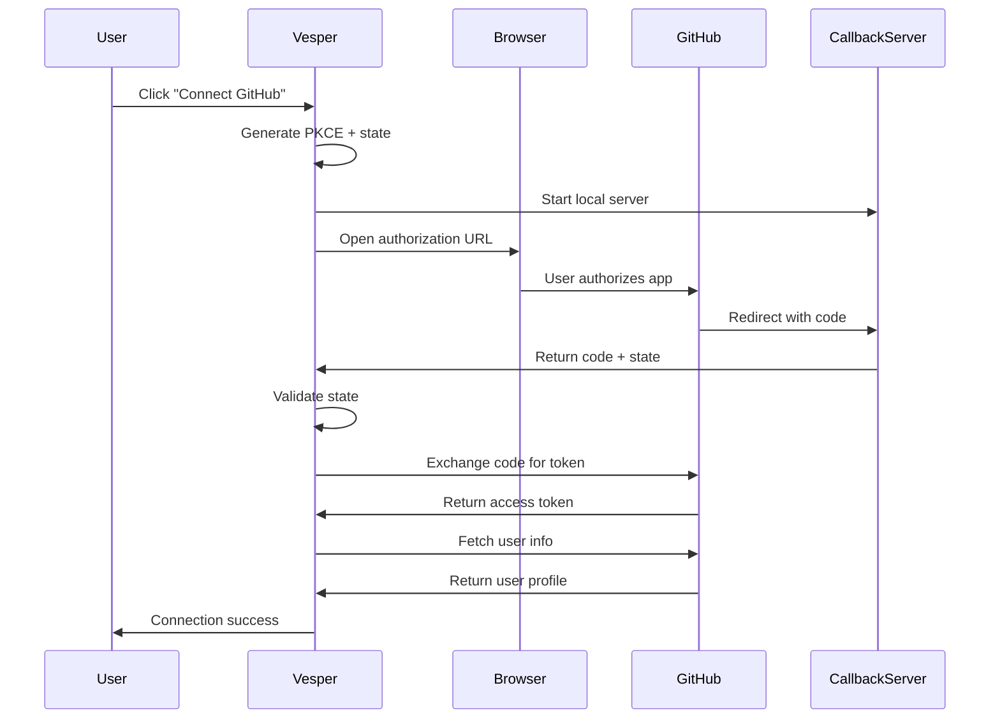

# GitHub OAuth API Reference

This document provides technical details for the GitHub OAuth integration implementation in Vesper.

## Architecture

The GitHub OAuth integration consists of three main components:

1. **OAuth Flow** (`packages/shared/src/github/oauth.ts`)
2. **UI Components** (`apps/electron/src/renderer/components/orchestration/`)
3. **IPC Layer** (electron main process handlers)

## OAuth Flow

### Implementation: `startGitHubOAuth()`

The OAuth flow follows GitHub's OAuth 2.0 specification with PKCE extensions.

**Flow Steps:**



### Function Signature

```typescript
export async function startGitHubOAuth(
  options?: GitHubOAuthOptions
): Promise<GitHubOAuthResult>

interface GitHubOAuthOptions {
  /** Scopes to request (defaults to GITHUB_SCOPES) */
  scopes?: string[];
  /** App type for callback server styling */
  appType?: AppType;
}

interface GitHubOAuthResult {
  success: boolean;
  accessToken?: string;
  expiresAt?: number;
  login?: string;
  email?: string;
  error?: string;
}
```

### Default Scopes

```typescript
export const GITHUB_SCOPES = [
  'repo',      // Full control of repositories
  'read:org',  // Read organization membership
  'read:user', // Read user profile data
];
```

### PKCE Implementation

**Code Verifier:**
- 32 random bytes encoded as base64url
- Cryptographically secure randomness via `crypto.randomBytes()`

**Code Challenge:**
- SHA-256 hash of verifier
- Encoded as base64url

**State Parameter:**
- 16 random bytes as hex
- Used for CSRF protection

```typescript
function generatePKCE(): { verifier: string; challenge: string } {
  const verifier = randomBytes(32).toString('base64url');
  const challenge = createHash('sha256').update(verifier).digest('base64url');
  return { verifier, challenge };
}

function generateState(): string {
  return randomBytes(16).toString('hex');
}
```

### Callback Server

A temporary HTTP server is created for receiving the OAuth callback:

```typescript
import { createCallbackServer } from '../auth/callback-server';

const callbackServer = await createCallbackServer({ appType: 'electron' });
const redirectUri = `${callbackServer.url}/callback`;
```

- **Port**: Random available port
- **Lifecycle**: Automatically closed after callback
- **Response**: Success/error page based on result

## Credential Management

### Storage

OAuth credentials are stored using the `CredentialManager`:

```typescript
import { getCredentialManager } from '@vesper/shared/credentials';

const credManager = getCredentialManager();

// Store Client ID
await credManager.set(
  { type: 'github_oauth_client_id' },
  { value: clientId }
);

// Store Client Secret
await credManager.set(
  { type: 'github_oauth_client_secret' },
  { value: clientSecret }
);

// Store Access Token (per workspace)
await credManager.set(
  {
    type: 'github_access_token',
    workspaceId: 'workspace-id',
    sourceId: 'github',
  },
  {
    value: accessToken,
    expiresAt: expiresAt,
  }
);
```

### Retrieval Priority

Credentials are retrieved with the following priority:

1. **CredentialManager** (UI-configured credentials)
2. **Environment Variables** (`GITHUB_OAUTH_CLIENT_ID`, `GITHUB_OAUTH_CLIENT_SECRET`)

```typescript
async function getGitHubCredentials(): Promise<{
  clientId: string;
  clientSecret: string;
} | null> {
  // Try CredentialManager first
  const storedId = await credManager.get({ type: 'github_oauth_client_id' });
  const storedSecret = await credManager.get({ type: 'github_oauth_client_secret' });

  if (storedId?.value && storedSecret?.value) {
    return { clientId: storedId.value, clientSecret: storedSecret.value };
  }

  // Fall back to environment variables
  const envId = process.env.GITHUB_OAUTH_CLIENT_ID;
  const envSecret = process.env.GITHUB_OAUTH_CLIENT_SECRET;

  if (envId && envSecret) {
    return { clientId: envId, clientSecret: envSecret };
  }

  return null;
}
```

## Test Connection Feature

### Implementation: `testGitHubCredentials()`

Validates OAuth credentials without starting a full OAuth flow.

```typescript
export async function testGitHubCredentials(
  clientId: string,
  clientSecret: string
): Promise<{ success: boolean; error?: string; message?: string }>
```

### Validation Steps

1. **Format Validation**
   - Client ID must start with `Ov` or `Iv`
   - Client ID must be at least 10 characters
   - Client Secret must be at least 20 characters

2. **API Validation**
   - Attempts to verify app exists using GitHub's check-token endpoint
   - Uses HTTP Basic Auth with Client ID and Secret
   - Tests against: `POST https://api.github.com/applications/{clientId}/token`

### Response Codes

| Status | Meaning | Result |
|--------|---------|--------|
| 404    | Token not found (expected for test) | Success |
| 422    | Validation error (credentials work) | Success |
| 401    | Invalid credentials | Failure |
| 403    | Forbidden (permission issue) | Failure |
| 429    | Rate limit exceeded | Failure |
| 500+   | GitHub server error | Failure |

### Example Usage

```typescript
const result = await testGitHubCredentials(
  'Ov23liYourClientId',
  'your_client_secret_here'
);

if (result.success) {
  console.log(result.message); // "GitHub OAuth credentials are valid"
} else {
  console.error(result.error); // Error description
}
```

## Retry Logic

Network operations use exponential backoff for transient failures.

### Retry Configuration

```typescript
async function retryWithBackoff<T>(
  fn: () => Promise<T>,
  maxAttempts: number = 3,
  initialDelayMs: number = 500
): Promise<T>
```

- **Max Attempts**: 3 by default
- **Initial Delay**: 500ms
- **Backoff**: Exponential (2^attempt)
- **Jitter**: ±25% random variation

### Non-Retryable Errors

These errors are thrown immediately without retry:

- 401 Unauthorized
- 403 Forbidden
- CSRF state mismatch

### Retryable Operations

1. **Token Exchange** (`exchangeCodeForToken`)
   - Retries on network errors and 5xx responses
   - 3 attempts with backoff

2. **User Info Fetch** (`getGitHubUser`)
   - Retries on network errors and 5xx responses
   - 3 attempts with backoff

## UI Components

### GitHubConnectModal

Modal dialog for OAuth flow initiation.

**Location**: `apps/electron/src/renderer/components/orchestration/GitHubConnectModal.tsx`

**State Management**:
```typescript
const [isOpen, setIsOpen] = useAtom(githubConnectModalOpenAtom);
const [oauthState, setOAuthState] = useAtom(githubOAuthStateAtom);
const [connection, setConnection] = useAtom(githubConnectionAtom);
```

**OAuth State**:
```typescript
interface OAuthState {
  isInProgress: boolean;
  error: string | null;
  success: boolean;
}
```

**Connection Status**:
```typescript
interface GitHubConnection {
  isConnected: boolean;
  login?: string;
  email?: string;
  connectedAt?: number;
}
```

### GitHubSettingsSection

Settings panel with 3-step setup process.

**Location**: `apps/electron/src/renderer/components/orchestration/GitHubSettingsSection.tsx`

**Setup Steps**:

1. **Configure OAuth App Credentials**
   - Client ID and Secret input fields
   - Test connection button
   - Save credentials button
   - Collapsible setup instructions

2. **Connect GitHub Account**
   - OAuth flow trigger button
   - Connection status display
   - Disconnect button

3. **Configure Repository** (Optional)
   - Repository owner/name inputs
   - Look back days configuration
   - Shown only when connected

**Status Badges**:
- Not Configured (gray)
- Configured (blue)
- Connected (green)

## IPC Handlers

The following IPC handlers must be implemented in the main process:

```typescript
// Check if OAuth credentials are configured
ipcMain.handle('github:hasOAuthCredentials', async (): Promise<boolean>)

// Test OAuth credentials
ipcMain.handle(
  'github:testCredentials',
  async (event, clientId: string, clientSecret: string):
    Promise<{ success: boolean; error?: string; message?: string }>
)

// Set OAuth credentials
ipcMain.handle(
  'github:setOAuthCredentials',
  async (event, clientId: string | null, clientSecret: string | null):
    Promise<{ success: boolean; error?: string }>
)

// Start OAuth flow
ipcMain.handle('github:startOAuth', async (): Promise<GitHubOAuthResult>)

// Get connection status
ipcMain.handle(
  'github:getStatus',
  async (event, workspaceId: string): Promise<GitHubConnection | null>
)

// Set connection status
ipcMain.handle(
  'github:setStatus',
  async (event, workspaceId: string, status: GitHubConnection):
    Promise<void>
)
```

## Security Best Practices

### Credential Protection

1. **Encryption**: All credentials encrypted with AES-256-GCM
2. **No Logging**: Credentials never logged in debug output
3. **Memory Clearing**: Form fields cleared after successful save
4. **Secure Transmission**: HTTPS only for all GitHub API calls

### CSRF Protection

1. **State Parameter**: Random 16-byte hex string
2. **State Validation**: Callback state must match request state
3. **One-Time Use**: State invalid after first callback

### Token Expiration

GitHub access tokens don't expire by default, but the system supports:

```typescript
interface StoredCredential {
  value: string;
  expiresAt?: number;  // Unix timestamp
}

// Check if token is expired
const isExpired = expiresAt && Date.now() > expiresAt;
```

### Scope Minimization

Request only required scopes:
- `repo`: Necessary for repository access
- `read:org`: Required for org repos only
- `read:user`: Minimal user info

Additional scopes can be added via `options.scopes`.

## Error Handling

### Error Types

```typescript
// Configuration error
{
  success: false,
  error: 'GitHub OAuth not configured. Add credentials in Settings...'
}

// CSRF error
{
  success: false,
  error: 'OAuth state mismatch - possible CSRF attack'
}

// User denial
{
  success: false,
  error: 'access_denied' // From GitHub
}

// Token exchange error
{
  success: false,
  error: 'Token exchange failed (401): Invalid credentials'
}

// Network error
{
  success: false,
  error: 'Network error. Please check your internet connection.'
}
```

### User-Friendly Messages

The UI presents errors with contextual help:

```tsx
{testResult && !testResult.success && (
  <div className="bg-red-50 dark:bg-red-950">
    <div>{testResult.error}</div>
    <div className="text-xs opacity-80">
      Double-check your Client ID and Secret match your GitHub OAuth App.
    </div>
  </div>
)}
```

## GitHub API Endpoints

### Authorization URL

```
GET https://github.com/login/oauth/authorize
  ?client_id={clientId}
  &redirect_uri={redirectUri}
  &scope={scopes}
  &state={state}
  &allow_signup=true
```

### Token Exchange

```
POST https://github.com/login/oauth/access_token
Content-Type: application/x-www-form-urlencoded
Accept: application/json

client_id={clientId}
&client_secret={clientSecret}
&code={code}
&redirect_uri={redirectUri}
```

**Response**:
```json
{
  "access_token": "gho_...",
  "token_type": "bearer",
  "scope": "repo,read:org,read:user"
}
```

### User Info

```
GET https://api.github.com/user
Authorization: Bearer {accessToken}
Accept: application/vnd.github.v3+json
```

**Response**:
```json
{
  "login": "octocat",
  "id": 1,
  "email": "octocat@github.com",
  "name": "The Octocat"
}
```

### Credential Test

```
POST https://api.github.com/applications/{clientId}/token
Authorization: Basic {base64(clientId:clientSecret)}
Accept: application/vnd.github.v3+json
Content-Type: application/json

{
  "access_token": "test_token_validation"
}
```

## TypeScript Interfaces

### Core Types

```typescript
// packages/shared/src/github/types.ts

export interface GitHubOAuthResult {
  success: boolean;
  accessToken?: string;
  expiresAt?: number;
  login?: string;
  email?: string;
  error?: string;
}

export interface GitHubOAuthOptions {
  scopes?: string[];
  appType?: 'electron' | 'cli' | 'web';
}

export interface GitHubConnection {
  isConnected: boolean;
  login?: string;
  email?: string;
  connectedAt?: number;
}
```

## Testing

### Unit Tests

Test the OAuth flow components:

```typescript
import { testGitHubCredentials, startGitHubOAuth } from '@vesper/shared/github/oauth';

describe('GitHub OAuth', () => {
  it('validates client ID format', async () => {
    const result = await testGitHubCredentials('invalid', 'secret');
    expect(result.success).toBe(false);
    expect(result.error).toContain('Invalid Client ID format');
  });

  it('validates client secret length', async () => {
    const result = await testGitHubCredentials('Ov23li...', 'short');
    expect(result.success).toBe(false);
    expect(result.error).toContain('too short');
  });
});
```

### Integration Tests

Test the full OAuth flow in a controlled environment:

1. Mock GitHub API responses
2. Intercept callback server
3. Verify token storage
4. Validate state handling

## Performance Considerations

### Optimization Strategies

1. **Credential Caching**: CredentialManager caches decrypted credentials
2. **Retry Jitter**: Prevents thundering herd on API failures
3. **Debounced Saves**: UI form changes don't trigger immediate saves
4. **Lazy Loading**: OAuth flow only loaded when needed

### Network Efficiency

- Single token exchange request
- Single user info fetch
- Test connection uses minimal API call
- No polling or long-running connections

## Related Documentation

- [User Guide: GitHub Integration](../user-guide/github-integration.md)
- [Credential Manager](./credential-manager.md)
- [Callback Server](./callback-server.md)

---

*Last Updated: 2026-01-26*
