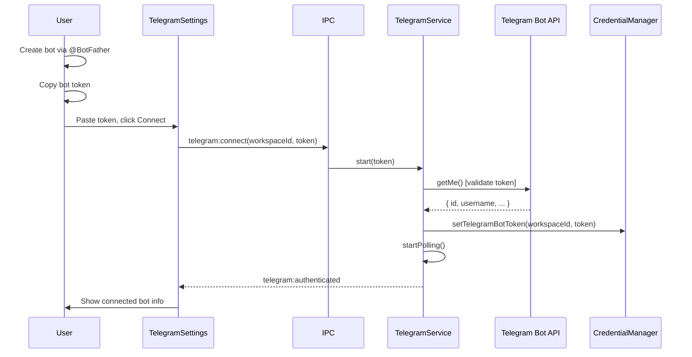
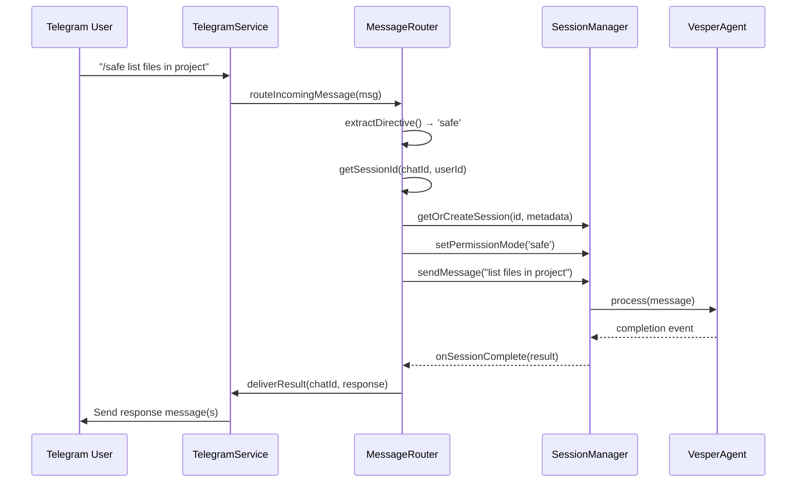

# Telegram Integration

**Type:** Feature Enhancement
**Status:** Planning
**Priority:** High
**Estimated Effort:** 10-14 hours
**Date:** 2026-01-25

## Overview

Add Telegram bot integration to Vesper, mirroring the existing WhatsApp integration architecture. This enables users to interact with Vesper's AI agent through Telegram group chats and direct messages, with full support for permission directives and session continuity.

Unlike WhatsApp (which uses QR code authentication via Baileys worker subprocess), Telegram uses a simpler bot token authentication model with in-process polling.

## Problem Statement / Motivation

### Why Telegram Integration?

1. **Broader Platform Coverage**: Telegram is widely used for developer communities, crypto/Web3 groups, and international teams where WhatsApp may be restricted
2. **Simpler Authentication**: Bot token auth is easier than QR codes - no mobile device scanning required
3. **Developer-Friendly**: Telegram's Bot API is well-documented with excellent TypeScript support
4. **Consistent Multi-Channel Strategy**: Complements WhatsApp integration for users active on multiple platforms

### User Story

> "As a Vesper user, I want to interact with my AI agent through Telegram so I can get work done without switching contexts when I'm already in Telegram group discussions."

## Proposed Solution

Implement Telegram integration following the proven WhatsApp architecture patterns:

- **Service Layer**: `TelegramService` (EventEmitter) for bot polling and message handling
- **IPC Layer**: Electron IPC handlers for renderer ↔ main process communication
- **Business Logic**: Message router, directive parser, session mapper (reuse WhatsApp patterns)
- **UI Layer**: Settings section for bot connection, toast notifications for activity

**Key Simplification**: Unlike WhatsApp's subprocess worker, Telegram runs in-process using `node-telegram-bot-api`.

## Technical Approach

### Architecture Overview

```
┌─────────────────────────────────────────────────────────────┐
│                    Renderer Process                         │
│  ┌────────────────────┐  ┌──────────────────────────────┐  │
│  │ TelegramSettings   │  │ TelegramToastListener        │  │
│  │ Section            │  │ (notifications)              │  │
│  └─────────┬──────────┘  └──────────────────────────────┘  │
│            │ IPC                                            │
└────────────┼────────────────────────────────────────────────┘
             │
┌────────────┼────────────────────────────────────────────────┐
│            ▼         Main Process                           │
│  ┌─────────────────────────────────────────────────────┐   │
│  │ TelegramService (EventEmitter)                      │   │
│  │  - start(botToken): Start polling                   │   │
│  │  - stop(): Stop polling, cleanup                    │   │
│  │  - sendMessage(chatId, text): Send to chat          │   │
│  │  - Events: message, error, polling_error            │   │
│  └──────────────────┬──────────────────────────────────┘   │
│                     │                                       │
│  ┌──────────────────▼─────────────────────────────────┐   │
│  │ TelegramMessageRouter                              │   │
│  │  - routeIncomingMessage(msg)                       │   │
│  │  - Parse directives (/safe, /ask, /allow-all)      │   │
│  │  - Map to Vesper session (deterministic)           │   │
│  │  - Monitor completion, deliver results             │   │
│  └──────────────────┬──────────────────────────────────┘   │
│                     │                                       │
│  ┌──────────────────▼─────────────────────────────────┐   │
│  │ SessionManager                                      │   │
│  │  - createSession(workspaceId, metadata)            │   │
│  │  - sendMessage(sessionId, content)                 │   │
│  │  - setSessionPermissionMode(sessionId, mode)       │   │
│  └────────────────────────────────────────────────────┘   │
└─────────────────────────────────────────────────────────────┘
```

### Library Choice: `node-telegram-bot-api`

**Selected**: `node-telegram-bot-api` v0.64.0+

**Rationale**:
- Official wrapper for Telegram Bot API
- Excellent TypeScript definitions via `@types/node-telegram-bot-api`
- Simple polling API (no webhook infrastructure needed for MVP)
- 10k+ GitHub stars, active maintenance
- Proven in production environments

**Installation**:
```bash
bun add node-telegram-bot-api
bun add -D @types/node-telegram-bot-api
```

**Alternative Considered**: `telegraf` (more features, middleware, scenes) - deferred to v2 for advanced use cases

### Authentication Flow



### Message Flow



## Implementation Phases

### Phase 1: Core Service (2-3 hours)

**Goal**: Telegram bot connects, receives messages, basic event handling

#### Files to Create

1. **`apps/electron/src/main/telegram-service.ts`** (300-400 lines)
   ```typescript
   import TelegramBot from 'node-telegram-bot-api'
   import { EventEmitter } from 'events'
   import type { CredentialManager } from '@vesper/shared/credentials'
   import type { TelegramMessage, TelegramConnectionStatus } from '@vesper/shared/telegram'

   export class TelegramService extends EventEmitter {
     private bot: TelegramBot | null = null
     private isRunning = false
     private connectionStatus: TelegramConnectionStatus
     private credentialManager: CredentialManager | null = null
     private messageRouter: TelegramMessageRouter | null = null

     constructor(private workspaceId: string) {
       super()
       this.connectionStatus = { isConnected: false, isConnecting: false }
     }

     async start(botToken: string): Promise<void> { /* ... */ }
     async stop(): Promise<void> { /* ... */ }
     async sendMessage(chatId: number, text: string): Promise<number> { /* ... */ }
     getConnectionStatus(): TelegramConnectionStatus { /* ... */ }
     private setupEventHandlers(): void { /* ... */ }
   }
   ```

2. **Credential Storage Extensions**
   - Update `packages/shared/src/credentials/credential-manager.ts`:
     - `getTelegramBotToken(workspaceId: string): Promise<string | null>`
     - `setTelegramBotToken(workspaceId: string, token: string): Promise<void>`
     - `deleteTelegramBotToken(workspaceId: string): Promise<void>`

**Tasks**:
- [ ] Install `node-telegram-bot-api` and type definitions
- [ ] Create `TelegramService` class with EventEmitter pattern
- [ ] Implement `start()` method: validate token, create bot instance, start polling
- [ ] Implement `stop()` method: stop polling, clear bot instance
- [ ] Implement `sendMessage()` for basic text delivery
- [ ] Add credential manager methods for encrypted token storage
- [ ] Add singleton factory: `getTelegramService(workspaceId)`
- [ ] Test: Connect with valid token, receive test message

**Success Criteria**:
- [ ] Bot successfully validates token and connects
- [ ] Receives incoming messages and emits `incoming_message` event
- [ ] Token stored encrypted in `~/.vesper/credentials.enc`
- [ ] Graceful disconnection and cleanup

### Phase 2: Business Logic (3-4 hours)

**Goal**: Message routing, directive parsing, session mapping, result formatting

#### Files to Create

1. **`packages/shared/src/telegram/types.ts`** (150-200 lines)
   ```typescript
   export interface TelegramMessage {
     id: number
     chatId: number
     chatTitle: string
     chatType: 'group' | 'supergroup' | 'private'
     userId: number
     username: string
     firstName: string
     content: string
     timestamp: number
     attachments?: TelegramAttachment[]
   }

   export interface TelegramSession { /* ... */ }
   export interface TelegramConnectionStatus { /* ... */ }
   export interface TelegramError { /* ... */ }
   export type TelegramErrorCode = /* ... */
   ```

2. **`packages/shared/src/telegram/directive-parser.ts`** (80-100 lines)
   ```typescript
   export type PermissionDirective = 'safe' | 'ask' | 'allow-all' | null

   export function extractDirective(message: string): {
     directive: PermissionDirective
     content: string
   } {
     // Parse /safe, /ask, /allow-all from message
     // Strip directive prefix, return clean content
   }
   ```

3. **`packages/shared/src/telegram/session-mapper.ts`** (100-120 lines)
   ```typescript
   export function getSessionId(chatId: number, userId: number): string {
     return `telegram_${chatId}::${userId}`
   }

   export class SessionMapper {
     async getOrCreateSessionId(chatId: number, userId: number): Promise<string>
     getSessionId(chatId: number, userId: number): string | null
   }
   ```

4. **`packages/shared/src/telegram/message-router.ts`** (500-600 lines)
   ```typescript
   export class TelegramMessageRouter {
     constructor(
       private workspaceId: string,
       private sessionManager: SessionManager,
       options?: { timeoutMs?: number }
     )

     async routeIncomingMessage(msg: TelegramMessage): Promise<void>
     setErrorFeedbackCallback(callback: ErrorFeedbackCallback): void
     onSessionComplete(callback: SessionCompleteCallback): () => void
   }
   ```

5. **`packages/shared/src/telegram/result-formatter.ts`** (150-200 lines)
   ```typescript
   export function formatLargeResult(
     responseText: string,
     workspaceId: string,
     sessionId: string
   ): string[] {
     // Chunk into 4096 char messages
     // Add deep links for large results
   }
   ```

6. **`packages/shared/src/telegram/message-queue.ts`** (100-120 lines)
   ```typescript
   export class MessageQueue {
     // Rate limiting: 30 messages/second per bot
     async enqueue(chatId: number, text: string): Promise<void>
   }
   ```

**Tasks**:
- [ ] Define all TypeScript interfaces in `types.ts`
- [ ] Implement `extractDirective()` (reuse WhatsApp logic)
- [ ] Implement `getSessionId()` deterministic mapping
- [ ] Create `TelegramMessageRouter` class:
  - [ ] Parse directives from incoming messages
  - [ ] Map to Vesper session (create if needed)
  - [ ] Set permission mode before sending
  - [ ] Monitor completion, deliver results
- [ ] Implement `formatLargeResult()` for chunking
- [ ] Implement `MessageQueue` for rate limiting
- [ ] Add comprehensive error categorization

**Success Criteria**:
- [ ] Directive parsing works: `/safe`, `/ask`, `/allow-all`
- [ ] Session mapping is deterministic (same chat+user = same session)
- [ ] Large results chunked correctly (≤4096 chars per message)
- [ ] Rate limiting prevents API throttling
- [ ] All error paths have user-friendly messages

### Phase 3: IPC Integration (1-2 hours)

**Goal**: Wire up renderer ↔ main process communication

#### Files to Create/Modify

1. **`apps/electron/src/main/telegram-ipc.ts`** (200-250 lines)
   ```typescript
   export function registerTelegramHandlers(sessionManager: SessionManager): void {
     ipcMain.handle(IPC_CHANNELS.TELEGRAM_CONNECT, async (_event, { workspaceId, botToken }) => {
       // Start service, save credentials, return status
     })

     ipcMain.handle(IPC_CHANNELS.TELEGRAM_DISCONNECT, async (_event, { workspaceId }) => {
       // Stop service, delete credentials
     })

     ipcMain.handle(IPC_CHANNELS.TELEGRAM_STATUS, async (_event, { workspaceId }) => {
       // Get connection status
     })

     ipcMain.handle(IPC_CHANNELS.TELEGRAM_SEND_MESSAGE, async (_event, { workspaceId, chatId, content }) => {
       // Send message to chat
     })
   }
   ```

2. **Update `apps/electron/src/shared/types.ts`**
   ```typescript
   export const IPC_CHANNELS = {
     // ... existing channels ...
     TELEGRAM_CONNECT: 'telegram:connect',
     TELEGRAM_DISCONNECT: 'telegram:disconnect',
     TELEGRAM_STATUS: 'telegram:status',
     TELEGRAM_SEND_MESSAGE: 'telegram:send-message',
     TELEGRAM_GET_CHATS: 'telegram:get-chats',
     TELEGRAM_MESSAGE_ACTIVITY: 'telegram:message-activity',
     TELEGRAM_ERROR: 'telegram:error',
   }
   ```

3. **Update `apps/electron/src/main/ipc.ts`**
   ```typescript
   import { registerTelegramHandlers } from './telegram-ipc'

   export function registerAllHandlers(sessionManager: SessionManager) {
     // ... existing handlers ...
     registerTelegramHandlers(sessionManager)
   }
   ```

**Tasks**:
- [ ] Create IPC handler functions for all operations
- [ ] Add IPC channel constants to shared types
- [ ] Register handlers in main IPC setup
- [ ] Wire up SessionManager integration
- [ ] Add error handling for all IPC calls
- [ ] Test: Renderer can connect/disconnect via IPC

**Success Criteria**:
- [ ] All IPC handlers respond correctly
- [ ] Errors propagate to renderer with user-friendly messages
- [ ] SessionManager integration works (messages route to sessions)
- [ ] Broadcast events reach all renderer windows

### Phase 4: UI Components (2-3 hours)

**Goal**: Settings UI for connection, toast notifications for activity

#### Files to Create

1. **`apps/electron/src/renderer/atoms/telegram.ts`** (80-100 lines)
   ```typescript
   import { atom } from 'jotai'

   export const telegramConnectionAtom = atom<TelegramConnectionStatus>({
     isConnected: false,
     isConnecting: false,
   })

   export const telegramErrorAtom = atom<string | null>(null)
   export const telegramBotTokenInputAtom = atom<string>('')
   ```

2. **`apps/electron/src/renderer/components/telegram/TelegramSettingsSection.tsx`** (300-350 lines)
   ```tsx
   export function TelegramSettingsSection() {
     const { activeWorkspaceId } = useAppShellContext()
     const [connection, setConnection] = useAtom(telegramConnectionAtom)
     const [botTokenInput, setBotTokenInput] = useAtom(telegramBotTokenInputAtom)

     const handleConnect = async () => {
       // IPC: telegram:connect
     }

     const handleDisconnect = async () => {
       // IPC: telegram:disconnect
     }

     return (
       <SettingsSection title="Telegram Integration">
         {/* Bot token input, connect/disconnect buttons */}
         {/* Active bot display */}
         {/* How it works instructions */}
       </SettingsSection>
     )
   }
   ```

3. **`apps/electron/src/renderer/components/telegram/TelegramToastListener.tsx`** (100-120 lines)
   ```tsx
   export function TelegramToastListener() {
     useEffect(() => {
       const cleanup = window.electronAPI.onTelegramMessageActivity((data) => {
         // Show toast based on status: received, processing, complete, error
       })
       return cleanup
     }, [])

     return null
   }
   ```

**Tasks**:
- [ ] Create Jotai atoms for state management
- [ ] Build `TelegramSettingsSection` component:
  - [ ] Bot token input (type="password" for masking)
  - [ ] Connect button with loading state
  - [ ] Disconnect button with confirmation
  - [ ] Active bot display (username, ID, chat count)
  - [ ] "How it works" instructions section
- [ ] Build `TelegramToastListener` for notifications
- [ ] Add to `WorkspaceSettingsPage`
- [ ] Wire up IPC event listeners
- [ ] Add desktop notification support
- [ ] Style to match WhatsApp settings section

**Success Criteria**:
- [ ] Settings UI renders correctly
- [ ] Bot token input is masked (password field)
- [ ] Connect button starts polling, shows loading state
- [ ] Active bot info displays after connection
- [ ] Disconnect button stops polling, deletes credentials
- [ ] Toast notifications appear for message activity
- [ ] Desktop notifications work on all platforms

### Phase 5: Testing (2-3 hours)

**Goal**: Comprehensive test coverage and manual validation

#### Test Files to Create

1. **`packages/shared/src/telegram/__tests__/directive-parser.test.ts`**
   ```typescript
   describe('extractDirective', () => {
     it('parses /safe directive', () => {
       expect(extractDirective('/safe list files'))
         .toEqual({ directive: 'safe', content: 'list files' })
     })

     it('defaults to null for no directive', () => {
       expect(extractDirective('just a message'))
         .toEqual({ directive: null, content: 'just a message' })
     })
   })
   ```

2. **`packages/shared/src/telegram/__tests__/session-mapper.test.ts`**
   ```typescript
   describe('getSessionId', () => {
     it('generates deterministic session IDs', () => {
       const id1 = getSessionId(123, 456)
       const id2 = getSessionId(123, 456)
       expect(id1).toBe(id2)
       expect(id1).toBe('telegram_123::456')
     })
   })
   ```

3. **`packages/shared/src/telegram/__tests__/message-router.test.ts`**
   ```typescript
   describe('TelegramMessageRouter', () => {
     it('routes message to correct session', async () => {
       const router = new TelegramMessageRouter(workspaceId, mockSessionManager)
       await router.routeIncomingMessage(mockMessage)
       expect(mockSessionManager.sendMessage).toHaveBeenCalledWith(
         'telegram_123::456',
         'test message'
       )
     })

     it('applies permission mode from directive', async () => {
       const msg = { ...mockMessage, content: '/safe test' }
       await router.routeIncomingMessage(msg)
       expect(mockSessionManager.setSessionPermissionMode)
         .toHaveBeenCalledWith(expect.any(String), 'safe')
     })
   })
   ```

4. **`packages/shared/src/telegram/__tests__/result-formatter.test.ts`**
   ```typescript
   describe('formatLargeResult', () => {
     it('returns single message for short results', () => {
       const result = formatLargeResult('Short response', workspaceId, sessionId)
       expect(result).toHaveLength(1)
     })

     it('chunks large results into multiple messages', () => {
       const largeText = 'x'.repeat(10000)
       const result = formatLargeResult(largeText, workspaceId, sessionId)
       expect(result.length).toBeGreaterThan(1)
       result.forEach(msg => expect(msg.length).toBeLessThanOrEqual(4096))
     })
   })
   ```

5. **`packages/shared/src/telegram/__tests__/acceptance.test.ts`**
   ```typescript
   describe('Telegram Integration (E2E)', () => {
     it('full flow: receive message → route → process → deliver', async () => {
       // Mock TelegramService, SessionManager
       // Send test message
       // Verify routing, session creation, permission mode
       // Simulate agent completion
       // Verify result delivery
     })
   })
   ```

**Manual Test Scenarios**:

1. **Bot Creation & Connection**
   - [ ] Create bot via @BotFather on Telegram
   - [ ] Copy bot token to Vesper settings
   - [ ] Click Connect, verify bot status displayed
   - [ ] Check credentials encrypted in `~/.vesper/credentials.enc`

2. **Permission Directives**
   - [ ] Send `/safe list files in ~/Desktop` in DM
   - [ ] Verify read-only mode (no writes allowed)
   - [ ] Send `/allow-all echo "test" > /tmp/test.txt`
   - [ ] Verify write operation succeeds
   - [ ] Send message with no directive
   - [ ] Verify defaults to safe mode

3. **Session Continuity**
   - [ ] Send message in group chat
   - [ ] Send follow-up message from same user
   - [ ] Verify same Vesper session (context preserved)
   - [ ] Send message from different user in same group
   - [ ] Verify different Vesper session (isolation)

4. **Large Results**
   - [ ] Ask for large file content (>4KB)
   - [ ] Verify result chunked into multiple messages
   - [ ] Verify each message ≤4096 chars
   - [ ] Verify deep link provided for very large results

5. **Error Handling**
   - [ ] Disconnect network, send message
   - [ ] Verify user-friendly error message
   - [ ] Send invalid command
   - [ ] Verify error feedback in Telegram
   - [ ] Test invalid bot token
   - [ ] Verify connection failure message

6. **Disconnection**
   - [ ] Click Disconnect in settings
   - [ ] Verify credentials deleted
   - [ ] Verify bot stops polling
   - [ ] Verify can reconnect with same token

**Tasks**:
- [ ] Write unit tests for all modules (target: 80%+ coverage)
- [ ] Write integration tests for full routing flow
- [ ] Set up test mocks for TelegramBot, SessionManager
- [ ] Run all manual test scenarios
- [ ] Document any edge cases discovered
- [ ] Fix all bugs found during testing

**Success Criteria**:
- [ ] All unit tests pass
- [ ] Integration tests cover happy path and error cases
- [ ] Manual testing completes all scenarios successfully
- [ ] No critical bugs remaining
- [ ] Test coverage ≥80% for business logic

## Alternative Approaches Considered

### 1. Webhook vs Polling

**Polling (Selected)**:
- ✅ Simpler setup (no public URL or HTTPS cert)
- ✅ Works behind firewalls/NATs
- ✅ Good for desktop app use case
- ❌ Slightly higher latency (~1-2 seconds)
- ❌ More server requests (though Telegram is generous)

**Webhook (Deferred to v2)**:
- ✅ Lower latency (instant push)
- ✅ More efficient for high-volume bots
- ❌ Requires public HTTPS endpoint
- ❌ Complex for desktop app (ngrok/tunneling needed)
- ❌ Certificate management overhead

**Decision**: Polling for MVP, webhook for production deployment if needed.

### 2. Subprocess vs In-Process

**In-Process (Selected)**:
- ✅ Simpler architecture
- ✅ Easier debugging and state management
- ✅ `node-telegram-bot-api` is lightweight
- ❌ Shares memory with main process

**Subprocess (Like WhatsApp)**:
- ✅ Isolation from main process
- ✅ Can restart independently
- ❌ Unnecessary complexity for Telegram
- ❌ IPC overhead for all operations

**Decision**: In-process for Telegram (simpler than WhatsApp's needs).

### 3. Library: `node-telegram-bot-api` vs `telegraf`

**`node-telegram-bot-api` (Selected)**:
- ✅ Official, minimal, stable
- ✅ Simple polling API
- ✅ Good for straightforward bot logic
- ❌ Less built-in features

**`telegraf` (Considered)**:
- ✅ Modern framework with middleware
- ✅ Scenes, sessions, advanced routing
- ✅ Better for complex conversational bots
- ❌ More opinionated, heavier
- ❌ Overkill for routing use case

**Decision**: `node-telegram-bot-api` for MVP simplicity.

## Acceptance Criteria

### Functional Requirements

- [ ] **Bot Connection**: User can connect Telegram bot with valid token
- [ ] **Message Reception**: Bot receives messages from groups and DMs
- [ ] **Directive Parsing**: `/safe`, `/ask`, `/allow-all` directives work correctly
- [ ] **Session Mapping**: Same user+chat maps to same Vesper session
- [ ] **Permission Modes**: Directives correctly set session permission modes
- [ ] **Result Delivery**: Agent responses delivered back to Telegram
- [ ] **Large Results**: Results >4KB chunked into multiple messages
- [ ] **Error Feedback**: Errors shown to users with friendly messages
- [ ] **Disconnection**: Disconnect button stops bot and deletes credentials

### Non-Functional Requirements

- [ ] **Security**: Bot token encrypted in `credentials.enc` (AES-256-GCM)
- [ ] **Rate Limiting**: Respects Telegram's 30 msgs/sec limit
- [ ] **Performance**: Message routing latency <2 seconds
- [ ] **Reliability**: Handles network errors gracefully, auto-reconnects
- [ ] **Privacy**: No sensitive data logged or exposed to users
- [ ] **GDPR Compliance**: Full credential deletion on disconnect

### Quality Gates

- [ ] **Test Coverage**: ≥80% coverage for business logic
- [ ] **Type Safety**: All TypeScript interfaces defined, no `any` types
- [ ] **Code Review**: Architecture reviewed against WhatsApp patterns
- [ ] **Documentation**: Setup instructions in CLAUDE.md
- [ ] **Manual Testing**: All test scenarios pass

## Success Metrics

### Technical Metrics

- **Connection Success Rate**: >95% of valid tokens connect successfully
- **Message Routing Latency**: <2 seconds from receive to session creation
- **Delivery Success Rate**: >98% of responses delivered to Telegram
- **Error Rate**: <2% of messages result in errors
- **Test Coverage**: ≥80% for shared business logic

### User Experience Metrics

- **Setup Time**: User can connect bot in <2 minutes
- **Response Time**: Agent responses feel responsive (<5 seconds for simple queries)
- **Error Clarity**: Users understand error messages without confusion
- **Session Continuity**: Context preserved across messages (no duplicate sessions)

## Dependencies & Prerequisites

### External Dependencies

- [x] `node-telegram-bot-api` v0.64.0+ (install via `bun add`)
- [x] `@types/node-telegram-bot-api` (install via `bun add -D`)
- [x] Telegram account for testing (create test bot via @BotFather)

### Internal Dependencies

- [x] WhatsApp integration (reference implementation)
- [x] `CredentialManager` for encrypted token storage
- [x] `SessionManager` for session CRUD and message routing
- [x] IPC infrastructure for renderer ↔ main communication
- [x] Settings UI framework (shadcn/ui components)

### Blockers

- None identified (all dependencies exist or are trivial to add)

## Risk Analysis & Mitigation

### Risk 1: Telegram API Rate Limiting

**Impact**: High (blocks message delivery)
**Probability**: Medium (if user has high-volume bot)

**Mitigation**:
- Implement `MessageQueue` with 30 msgs/sec limit
- Add exponential backoff for rate limit errors
- Show warning in UI if approaching limits

### Risk 2: Bot Token Leakage

**Impact**: Critical (unauthorized bot access)
**Probability**: Low (encrypted storage)

**Mitigation**:
- Store token encrypted in `credentials.enc` (AES-256-GCM)
- Mask token in UI (password input)
- Never log token in plaintext
- Delete token on disconnect (GDPR compliance)

### Risk 3: Session ID Collisions

**Impact**: Medium (wrong session receives messages)
**Probability**: Very Low (deterministic hash-based IDs)

**Mitigation**:
- Use deterministic `telegram_{chatId}::{userId}` format
- Add unit tests for session mapping
- Log session creation for debugging

### Risk 4: Polling Reliability

**Impact**: Medium (missed messages during downtime)
**Probability**: Low (Telegram queues messages)

**Mitigation**:
- Telegram queues messages for offline bots
- Add auto-reconnect on network errors
- Show connection status in UI

## Resource Requirements

### Development Time

- **Phase 1 (Core Service)**: 2-3 hours
- **Phase 2 (Business Logic)**: 3-4 hours
- **Phase 3 (IPC Integration)**: 1-2 hours
- **Phase 4 (UI Components)**: 2-3 hours
- **Phase 5 (Testing)**: 2-3 hours

**Total Estimated Effort**: 10-14 hours

### Team Requirements

- **Backend Developer**: 1 (main process, IPC, service layer)
- **Frontend Developer**: 1 (React UI, Jotai atoms)
- **QA Engineer**: 0.5 (manual testing, edge cases)

**Can be done by single full-stack developer in 2-3 days.**

### Infrastructure

- No additional infrastructure needed (desktop app)
- Test bot required (free via @BotFather)
- Telegram account for testing (free)

## Future Considerations

### Post-MVP Enhancements

1. **Webhook Support** (v1.1)
   - Faster response times for production bots
   - Requires public HTTPS endpoint (ngrok or deployed server)

2. **Inline Keyboards** (v1.2)
   - Interactive permission approval buttons
   - `/ask` mode shows approve/deny inline buttons

3. **File Attachments** (v1.3)
   - Download files from Telegram messages
   - Pass to agent as context (images, PDFs, code files)

4. **Multi-Bot Support** (v1.4)
   - Multiple bots per workspace
   - Route based on bot username or chat

5. **Telegram-Specific Commands** (v1.5)
   - `/start` - Bot introduction
   - `/help` - Command reference
   - `/status` - Session status

6. **Message Editing** (v2.0)
   - Update previous responses
   - Show "thinking..." status while processing

7. **Channel Posting** (v2.1)
   - Post agent results to Telegram channels
   - Scheduled posts, automated reports

### Extensibility Points

- **Custom Directive Handlers**: Plugin system for new directives (e.g., `/summarize`)
- **Message Preprocessors**: Transform messages before routing (e.g., translate)
- **Result Postprocessors**: Custom formatting for Telegram (e.g., code blocks)
- **Analytics Hooks**: Track usage, popular commands, error rates

## Documentation Plan

### Files to Update

1. **`/Users/tinnguyen/vesper/CLAUDE.md`**
   - Add Telegram Integration to Recent Features section
   - Document file structure, IPC channels, data models
   - Add to "Common Tasks" section

2. **`/Users/tinnguyen/vesper/README.md`**
   - Add Telegram Integration to features list
   - Update screenshots if UI changes

3. **`/Users/tinnguyen/vesper/docs/telegram-setup.md`** (new)
   - Step-by-step setup guide
   - @BotFather bot creation instructions
   - Troubleshooting common issues

4. **`packages/shared/src/telegram/README.md`** (new)
   - Architecture overview
   - API documentation for each module
   - Code examples for extending

### User-Facing Documentation

- [ ] Setup guide: How to create bot via @BotFather
- [ ] Permission directives reference: `/safe`, `/ask`, `/allow-all`
- [ ] Troubleshooting: Common errors and solutions
- [ ] Security: How bot tokens are stored

## References & Research

### Internal References (WhatsApp Integration)

- **Service Pattern**: `/Users/tinnguyen/vesper/apps/electron/src/main/whatsapp-service.ts`
  - EventEmitter architecture
  - Credential manager integration
  - Message router setup

- **IPC Handlers**: `/Users/tinnguyen/vesper/apps/electron/src/main/whatsapp-ipc.ts`
  - Handler registration pattern
  - Error response format
  - Event broadcasting to renderer

- **Message Router**: `/Users/tinnguyen/vesper/packages/shared/src/whatsapp/message-router.ts`
  - Directive parsing integration
  - Session mapping logic
  - Completion callback pattern

- **Directive Parser**: `/Users/tinnguyen/vesper/packages/shared/src/whatsapp/directive-parser.ts`
  - Regex patterns for `/safe`, `/ask`, `/allow-all`
  - Content stripping logic

- **Session Mapper**: `/Users/tinnguyen/vesper/packages/shared/src/whatsapp/session-mapper.ts`
  - Deterministic session ID generation
  - Composite key pattern (groupJid + senderJid)

- **Result Formatter**: `/Users/tinnguyen/vesper/packages/shared/src/whatsapp/result-formatter.ts`
  - Message chunking (4096 char limit)
  - Deep link generation for large results

- **Settings UI**: `/Users/tinnguyen/vesper/apps/electron/src/renderer/components/whatsapp/WhatsAppSettingsSection.tsx`
  - Connection/disconnection UX
  - IPC integration pattern
  - Event listener cleanup

- **State Management**: `/Users/tinnguyen/vesper/apps/electron/src/renderer/atoms/whatsapp.ts`
  - Jotai atom structure
  - Connection status model

### External References

- **Telegram Bot API Documentation**: https://core.telegram.org/bots/api
  - Official API reference
  - Rate limits, best practices

- **node-telegram-bot-api**: https://github.com/yagop/node-telegram-bot-api
  - Library documentation
  - TypeScript usage examples
  - Polling vs webhook setup

- **@BotFather**: https://t.me/BotFather
  - Bot creation guide
  - Command reference

- **Telegram Bot Best Practices**: https://core.telegram.org/bots/faq
  - Security recommendations
  - Performance optimization

### Related Work

- **WhatsApp Integration**: Reference implementation for architecture
- **MCP Server Integration**: Reference for external service patterns
- **Permission Modes**: Existing implementation reused for directives

---

**Plan Created**: 2026-01-25
**Next Steps**: Review plan → Run `/deepen-plan` for enhanced research → Begin Phase 1 implementation
