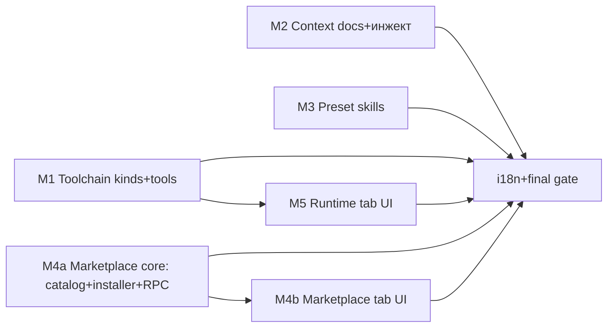

# Implementation Plan: Runtime / Context / Marketplace (M1–M5)

- **Статус**: утверждён к реализации
- **Спек**: `docs/runtime-context-marketplace-prd.md` (обязателен к прочтению всеми реализаторами)
- **Репо**: `/Users/marklindgreen/Projects/craft-agents`, база `main @ 43e0b72ac` (включая 2 чужих грязных файла: `apps/electron/src/renderer/pages/BrowserPanelPage.tsx`, `packages/shared/src/protocol/routing.ts` — НЕ трогать и не коммитить чужие правки)

## 0. Кросс-срезные контракты (фиксируются до фан-аута)

### 0.1 Конфиг (`packages/shared/src/config/storage.ts`, StoredConfig)

```ts
// Добавки к StoredConfig (все optional с дефолтами — обратная совместимость):
toolchain?: { disabled?: string[] }            // имена tool'ов из manifest
bundledSkills?: { disabled?: string[] }        // slug паков из resources/skills
marketplace?: { catalogEtag?: string; lastCatalogFetchAt?: number }
```

### 0.2 Пути

| Что | Путь |
|---|---|
| Контекст-документы рантайма | `<CONFIG_DIR>/context/*.md` (soul.md, rules.md, user-*.md) |
| Бандл шаблонов контекста | `apps/electron/resources/context/{soul.md,rules.md}` |
| Бандл пресет-скиллов | `apps/electron/resources/skills/<slug>/SKILL.md…` |
| Marketplace | `<CONFIG_DIR>/marketplace/{catalog.cache.json, stats-cache.json, lock.json}` |
| Установленные скиллы | `~/.agents/skills/<slug>/` (глобальный ярус, без изменений discovery) |

### 0.3 Новые RPC-каналы (`packages/shared/src/protocol/channels.ts`)

```
toolchainSetDisabled   'toolchain:setDisabled'      LOCAL_ONLY
contextDocsList        'contextDocs:list'           LOCAL_ONLY
contextDocsRead        'contextDocs:read'           LOCAL_ONLY
contextDocsWrite       'contextDocs:write'          LOCAL_ONLY
contextDocsChanged     'contextDocs:CHANGED' (push) LOCAL_ONLY
marketplaceCatalog     'marketplace:catalog'        LOCAL_ONLY
marketplaceStats       'marketplace:stats'          LOCAL_ONLY
marketplaceInstall     'marketplace:install'        LOCAL_ONLY
marketplaceRemove      'marketplace:remove'         LOCAL_ONLY
marketplaceUpdate      'marketplace:update'         LOCAL_ONLY
marketplaceRefresh     'marketplace:refreshCatalog' LOCAL_ONLY
marketplaceChanged     'marketplace:CHANGED' (push) LOCAL_ONLY
```

Каждый канал: `channels.ts` → `apps/electron/src/transport/channel-map.ts` → `src/shared/types.ts` (ElectronAPI) → handler в `packages/server-core/src/handlers/rpc/` → **классификация в `packages/shared/src/protocol/routing.ts` (LOCAL_ONLY)** → строка в `apps/electron/src/shared/__tests__/ipc-channels.test.ts`. В routing.ts — аккуратный merge поверх чужого WIP (2 грязные строки соседней сессии остаются нетронутыми).

### 0.4 Toolchain manifest

```ts
type ToolKind = 'binary' | 'npm' | 'git-npm' | 'pip' | 'brew' | 'detect';
type ToolTier = 'core' | 'default-on' | 'opt-in';
// MANIFEST entry += { kind: ToolKind, tier: ToolTier, platforms?: ('mac'|'linux'|'win')[], source?: {...} }
```

Существующие 11 инструментов получают `tier: 'core'`, kinds «binary»/«npm» остаются неизменными. `ensureAll` фильтрует: `disabled` из config → skip; `detect` → только detection-статус; `brew` → только при наличии brew на хосте (mac), иначе `skipped-no-brew`.

### 0.5 i18n

Неймспейсы: `settings.runtime.*`, `settings.context.*`, `settings.marketplace.*`, `marketplace.*`, `contextDocs.*`, `toolchain.*` (расширение). Все 9 локалей; en/ru — полноценные, остальные 7 — осмысленный перевод (не en-fallback), parity-тест должен быть зелёным. Описания маркетплейса живут в каталоге (`descriptionRu`), **не** в i18n-файлах.

### 0.6 Правило валидации для срезов

Каждый срез: только локальный проверочный сценарий (smoke-скрипт/точечный тест) + `bunx tsc --noEmit` по затронутому пакету. ПОЛНЫЙ `bun test` по монорепе запускает главная сессия один раз после мержа всех волн. Линтеры/форматтеры гонять запрещено (repo-wide biome соседним сессиям мешает).

## 1. Волны



- Волна 1 (параллельно): M1, M2, M3, M4a — не пересекаются по файлам (toolchain / prompts+agent / resources+skills / server-core+protocol).
- Волна 2: M5 (нужен `toolchain:setDisabled` из M1), M4b (нужны каналы M4a). Оба UI-среза независимы друг от друга.
- Финал: i18n-добивка (все новые ключи во все локали), `bun test`, сборка smoke приложения.

Инструкции срезам: работать в общем дереве (этот репо), коммитов НЕ делать — главная сессия коммитит по срезам после верификации.

## 2. M1 — Toolchain kinds + новые инструменты

**Файлы**: `packages/shared/src/toolchain/{manifest-data.ts,manager.ts,installer.ts,downloader.ts,npm-locks.ts,state.ts}`, новый `scripts/toolchain-locks.ts`, точечный тест `packages/shared/src/toolchain/__tests__/kinds.test.ts`.

1. Завести `ToolKind`/`ToolTier`, мигрировать 11 существующих записей.
2. `manager.ensureAll`: фильтр по `config.toolchain.disabled` + tier-логика (core всегда; default-on если не выключен; opt-in — только в списке enabled… opt-in включается через marketplace/catalog, для M1: через `disabled`-inverse — НЕТ, использовать `marketplace`-слой позже; для M1 opt-in = не ставится через ensureAll, ставится через `update(name)`).
3. Новый kind `git-npm`: `bun install -g github:<repo>@<commit>` через toolchain-bun, лончер в `bin/`, pin commit + запись в npm-locks-аналог (`getGitLock()`), fail-closed без записи.
4. Новый kind `pip`: `uv pip install --require-hashes` в изолированный venv внутри toolchain-дира, shim-лончеры.
5. Новый kind `brew`: preflight `command -v brew`; ставит формулу pinned версии (`brew install <formula>`), статус `skipped-no-brew` если brew нет.
6. Новый kind `detect`: только `findExecutable`, статус `detected`/`missing`.
7. Добавить инструменты: just, fzf, mise, worktrunk, gstack, infisical (binary, default-on); opencode-ai, oh-my-openagent, oh-my-codex, oh-my-claude-sisyphus, eve, `skills` (npm, default-on; eve opt-in); oh-my-hermes (npm/git-npm, opt-in); gbrain (git-npm, default-on); agent-browser (npm, opt-in); mole (brew, opt-in, mac); docker, brew (detect, opt-in).
8. Проталкивать disabled-конфиг: `settings/workspaceSettings`-стиль геттер/сеттер + новый канал `toolchain:setDisabled`.
9. Версии и sha256/locks: для binary — реальные релиз-хэши (скрипт-хелпер `scripts/toolchain-locks.ts` генерит записи, результаты проверяются запуском на mac-arm64; linux/win берутся из релиз-матрицы).
10. Smoke: `bun scripts/toolchain-smoke.ts` (существующий) + точечный test заявленных новых резолверов на моках (без сети в юнитах).

**Accept**: на чистом `CRAFT_CONFIG_DIR` ensureAll ставит core+default-on; disabled=['fzf'] исключает fzf; brew-handle → skipped-no-brew; tsc чист; toolchain-smoke зелёный на mac-arm64.

## 3. M2 — Контекст-документы + инжект

**Файлы**: `apps/electron/resources/context/{soul.md,rules.md}` (тексты из приложений A/B спеки — финальная редакция), `packages/shared/src/context-docs/index.ts` (НОВЫЙ), `packages/shared/src/prompts/system.ts`, `packages/shared/src/agent/omp-agent.ts`, `packages/shared/src/config/watcher.ts`, handlers `packages/server-core/src/handlers/rpc/context-docs.ts` (НОВЫЙ).

1. `ensureContextDocs()`: seed шаблонов в `<CONFIG_DIR>/context/` один раз, версионный заголовок `<!-- context-doc-version: N -->`, upgrade-баннер через статус (не затирать правки).
2. Инжект: `getSystemPrompt()` — новый блок `contextDocs` (после projectBlock, до memory), per-file 20KB cap, XML-defang; `buildCraftContextPrompt()` в omp-agent — то же содержимое. `CONTEXT_FILE_PATTERNS += ['soul.md','rules.md']` (project-файлы переопределяют глобальные по имени).
3. RPC `contextDocs:list/read/write` + watcher-пуш `contextDocs:CHANGED` (ConfigWatcher добавить директорию context/).
4. Точечные тесты: seed-потом-правка-пользователя-сохранилась; инжект виден в промпте OMP (юнит на buildCraftContextPrompt).

**Accept**: чистый старт → оба файла лежат; правка rules.md в файле отражается в следующем `--append-system-prompt` OMP-сессии; version-merge не затирает правку.

## 4. M3 — Пре-установленные скиллы

**Файлы**: `apps/electron/resources/skills/…` (вендоринг), `packages/shared/src/skills/bundled.ts` (НОВЫЙ), cd apps/electron build-конфиг (ensure resources copied — проверить build-dmg стейджинг), `packages/shared/src/config/storage.ts` (bundledSkills.disabled — из §0.1).

1. Вендоринг паков (pinned commit каждого; `resources/skills/SKILLS.lock` с sha + origin): superpowers, vercel-labs/agent-skills, vercel-labs/next-skills, mattpocock/skills (подмножества? — полные, вес мал). LICENSE каждого пака копируется (MIT).
2. `ensureBundledSkills()`: синк в `~/.agents/skills/<slug>` атомарно; hash-merge (локальные правки НЕ затирать: mismatch → skip+флаг `localModified`); чест с `bundledSkills.disabled`.
3. Хук в bootstrap (рядом с initializeDocs в main/index.ts).
4. Тест: после рамочного старта скилл из пака резолвится discovery (storage.ts loadAllSkills).

**Accept**: свежий HOME → superpowers доступен агенту; disable → синк прекращает трогать slug; правка пользовательского файла в паке переживает апгрейд пака.

## 5. M4 — Marketplace

**M4a core** (`packages/shared/src/marketplace/{catalog.ts,installer.ts,stats.ts,lock.ts}` + handler `server-core/src/handlers/rpc/marketplace.ts` + `resources/marketplace/catalog.json`):
1. catalog.json: схема из PRD §8.1 + `descriptionRu` + `catalogVersion`. Источники: записи из PRD §4.2 + vercel-набор §15.
2. Remote-refresh: fetch raw URL (ETag, 24ч TTL, atomic swap кэша, fallback bundle).
3. Installer: git clone --depth 1 pinned ref → verify SHA-256 → stage в `~/.agents/skills/<slug>` (skillpack) или toolchain-toggle (tool) или `<CONFIG_DIR>/context/` (context-doc); atomic; lock.json. Пост-установочных скриптов НЕ выполнять.
4. Stats: GitHub REST (stars, pushed_at) + npm (weekly downloads) с 6ч кэшем; оффлайн-деградация.
5. RPC-каналы §0.3 (marketplace:*) + routing + ipc-channels test.

**M4b UI** (`apps/electron/src/renderer/pages/settings/MarketplaceSettingsPage.tsx` + settings-registry/menu-schema/icons/routes/sidebar-whitelist): карточки с ★/⬇/«обновлён N дней назад», RU-описания, сортировки, install/update/remove, push-прогресс, skeleton при stats-loading.

**Accept**: install vercel-agent-skills из (мок-)каталога → пак в `~/.agents/skills`; refresh берёт новый catalogVersion; метрики отображаются с кэшем; remove делает soft-clean.

## 6. M5 — Runtime вкладка

**Файлы**: `apps/electron/src/renderer/pages/settings/RuntimeSettingsPage.tsx` (НОВЫЙ), содержимое ToolchainSettingsPage → в Runtime (роут `settings/toolchain` → редирект `settings/runtime`), settings-registry/menu-schema/icons/routes/sidebar-whitelist/i18n.

Секции: Model connections (компактный блок, существующая механика llm), Thinking level (существующие каналы), Approval mode, Toolchain (перенос + disabled-тоглы через `toolchain:setDisabled`), Env overrides (новый редактор → config). Применение без рестарта где каналы уже горячие (thinking/model — да; approval — пометка «респавн»).

**Accept**: вкладка видна в навигаторе и меню; тогл fzf сохраняется в config.json и ensureAll его пропускает; старый роут редиректит.

## 7. Финальный гейт (главная сессия)

1. i18n: добить ключи всех срезов во все 9 локалей, parity-тест.
2. `bun test` (полный), `bunx tsc --noEmit` по монорепе.
3. Ручной smoke приложения (bun run dev): три вкладки, install из маркетплейса, новая сессия с rules.md в промпте.
4. Коммиты по срезам (+ пуш по запросу пользователя).

## 8. Риски реализации

- `scripts/toolchain-locks.ts`: sha256 binary-релизов надо добывать по платформам (скрипт качает релизы и считает — может занять время, ~8 инструментов × 4 платформы; mac/x64 наши, linux/win — из релизных checksum-файлов проектов где есть; где нет — качать).
- gbrain git-install: bun install -g github:… — проверить, что на toolchain-bun работает headless.
- Чужой WIP: routing.ts — apply только добавления, не форматировать файл целиком.
- Вес electron-ресурсов после вендоринга скиллов: контроль, <50MB.
