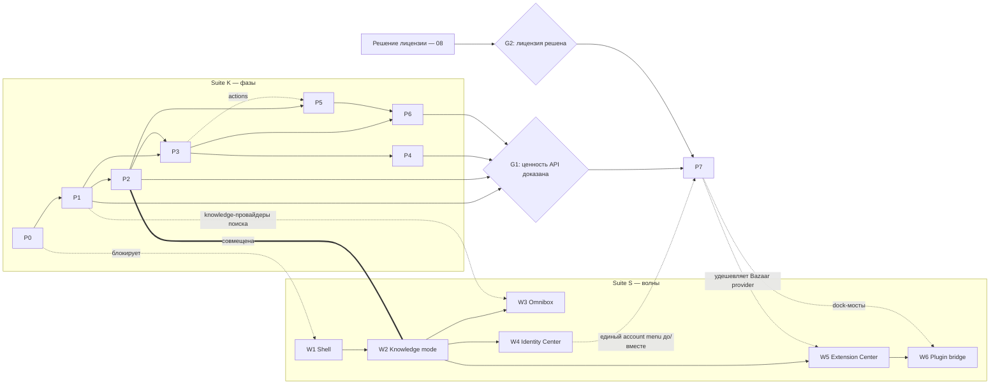

# K-11. Дорожная карта интеграции SiYuan → Craft (фазы P0–P7)

| Поле | Значение |
| --- | --- |
| Doc ID | K-11 |
| Название | Дорожная карта интеграции: фазы P0–P7 и связка с волнами W1–W6 |
| Статус | draft |
| Дата | 2026-08-07 |
| Набор | Suite K — `docs/specs/2026-08-07-siyuan-integration/` |
| Входные документы | архитектурный вердикт «Craft × SiYuan» (исходный, §16 «Последовательность поглощения»), документ «Единая оболочка» (исходный, §17 «Последовательность реализации (волны)»), [обзор](./00-overview.md), [ADR](./01-adrs.md), [волны оболочки](../2026-08-07-unified-shell/09-roadmap-waves.md) |

## Цель

Дать исполнимый план поглощения SiYuan форком `agisota/craft-agents-oss`: восемь фаз P0–P7 (из §16 вердикта) с проверяемыми критериями выхода, явными зависимостями от других фаз и от волн единой оболочки W1–W6 ([suite S](../2026-08-07-unified-shell/09-roadmap-waves.md)), реализационными задачами по компонентам с привязкой к реальному коду, рисками и метриками.

## Контекст и мотивация

Вердикт (§16) задаёт только последовательность: P0 — ADR, P1 — read-only provider, P2 — раздел Knowledge, P3 — write-back, P4 — Session → Knowledge, P5 — сохранённые представления, P6 — автоматизации, P7 — managed kernel. Параллельно документ оболочки (§17) задаёт волны UI: W1 — единый shell, W2 — Knowledge mode, W3 — Omnibox, W4 — Identity Center, W5 — Extension Center, W6 — Plugin bridge. Две последовательности ортогональны: фазы K строят контур данных и записи (backend + интеграционная безопасность), волны S строят каркас интерфейса. Без этого документа не видно: (а) где фаза обязана ждать волну (P2 ≡ W2), (б) где волна обязана ждать фазу (W3 Omnibox без P1 не ищет по знаниям), (в) какие гейты стоят перед P7 (доказательство ценности API-интеграции + решение лицензии из [08-licensing.md](./08-licensing.md)).

Форк сегодня: Bun monorepo (`packages/*` + `apps/*`, `craft-agent` v0.11.3), Electron desktop (`apps/electron`) как основное приложение, headless-сервер (`packages/server`), собственный `cloud-runner`. Ни одного `knowledge.*`/`siyuan.*` канала, реестра поверхностей или командной палитры в коде нет — всё это «новые компоненты» фаз ниже; каждая фаза опирается на существующие механизмы (RPC-волна каналов, файловые хранилища, AutomationSystem, panel-stack, BrowserPaneManager), а не на новую инфраструктуру.

## Решение

### Принципы планирования

1. **Read-only first.** Запрос на запись не существует в API, пока не построен proposal-контур (ADR-004). Запрещённые операции не фильтруются — они *не реализуются*.
2. **Фазы гейтят фазы, волны гейтят волны.** Внутри suite K порядок строгий: P(n+1) требует критерии выхода P(n), кроме явно параллельных связок (P5 ∥ P4). Suite S развивается своими волнами; пересечения — только через контракты, зафиксированные в таблице ниже.
3. **Один канальный паттерн.** Любой новый backend-контур идёт существующей «RPC-волной»: `packages/shared/src/protocol/channels.ts` → `routing.ts` (гейт `packages/shared/src/protocol/__tests__/routing.test.ts`) → `events.ts` → `packages/server-core/src/handlers/rpc/<domain>.ts` (`HANDLED_CHANNELS` + `register*Handlers`) → `handlers/rpc/index.ts` (`registerCoreRpcHandlers`, общий для `apps/electron/src/main/handlers/index.ts` и `packages/server/src/index.ts`) → `apps/electron/src/transport/channel-map.ts`.
4. **Файловые хранилища, не ORM.** Bridge-хранилище — scoped file stores с атомарной записью tmp+rename (прецедент `packages/server-core/src/memory/`: MemoryFileStore/LessonStore/AuditLog); единственный SQLite в репо — fail-soft FTS5-проекция `packages/server-core/src/memory/fts-index.ts`. Отдельные файлы bridge, никакой общей базы с SiYuan (ADR-003, см. [04-bridge-storage.md](./04-bridge-storage.md)).
5. **External-local — единственный производственный режим до P7.** Пользователь ставит SiYuan сам, Craft подключается к `localhost:6806` ([07-connection-modes.md](./07-connection-modes.md)); remote — отдельный трек в том же документе.
6. **Минимум новых пакетов.** Старт внутри существующих границ (`packages/core/src/knowledge/`, `apps/electron/src/...`), выделение `packages/knowledge-core/` + `packages/knowledge-siyuan/` — только когда модуль реально используется Electron + server + CLI (см. Открытые вопросы).

### Сводная таблица фаз

| Фаза | Содержание | Зависит от | Волны shell (S) | Документы-владельцы | Гейт выхода (кратко) |
| --- | --- | --- | --- | --- | --- |
| **P0** | Принятие ADR-001…006 | — | блокирует W1–W6 | [01-adrs.md](./01-adrs.md) | 6/6 ADR в статусе accepted |
| **P1** | Read-only knowledge provider | P0 | ∥ W1; питает W3 | [03](./03-knowledge-provider-contract.md), [04](./04-bridge-storage.md), [07](./07-connection-modes.md) | агент читает SiYuan, не может испортить данные: 0 write-каналов |
| **P2** | Нативный раздел Knowledge | P1, W1 | ≡ W2 | [02](./02-integration-boundaries.md), [07](./07-connection-modes.md); S:[01](../2026-08-07-unified-shell/01-shell-slots.md)–[03](../2026-08-07-unified-shell/03-panels-rails.md) | работа с документом без второго app shell |
| **P3** | Безопасный write-back | P1, P2 | поверх W2 | [05](./05-mutation-safety.md), [04](./04-bridge-storage.md) | proposal→diff→approval→apply + conflict + rollback; 0 записей без approval |
| **P4** | Session → Knowledge | P3 | W2 (+W3 soft) | [06](./06-publication-pipeline.md) | публикация с provenance и двусторонними ссылками |
| **P5** | Saved Knowledge Views | P2, P3 (soft: actions) | W2 | [09](./09-collection-view-engine.md); S:[08](../2026-08-07-unified-shell/08-work-envelope.md) | обобщённый view engine; knowledge-представления работают, сессии без регрессий |
| **P6** | Knowledge automations | P3, P5 | ∥/после W3 | [10](./10-skills-automations.md) | end-to-end сценарий needs-research → cloud run → reviewed write-back |
| **P7** | Managed kernel | P1–P6 + гейты G1, G2 | W4 до/вместе; W5–W6 после | [07](./07-connection-modes.md), [08](./08-licensing.md); S:[07](../2026-08-07-unified-shell/07-identity-center.md), [05](../2026-08-07-unified-shell/05-extension-center.md), [06](../2026-08-07-unified-shell/06-plugin-bridge.md) | весь набор проверок P1–P6 зелёный на `mode=managed` |

Сокращения: ∥ — параллельно; ≡ — фаза и волна совмещены (один релиз); soft — мягкая необязательная связка.

## P0 — Принятие ADR (гейт старта)

**Цель фазы.** Зафиксировать шесть архитектурных решений до первой строки интеграционного кода: ADR-001 Craft is host product; ADR-002 SiYuan owns canonical knowledge; ADR-003 No shared database; ADR-004 All agent writes use proposals; ADR-005 Operational and semantic metadata remain separate; ADR-006 Session is not a document.

**Scope.** Полный текст ADR в [01-adrs.md](./01-adrs.md) (контекст, решение, следствия, запреты); публикация обеих spec-сюит (K и S); фиксация числовых порогов гейта G1 для P7 (см. Открытые вопросы).

**Зависимости.** Нет. Блокирует: P1–P7 и все волны W1–W6 (любая реализация обязана ссылаться на ADR; UI-волны зависят от ADR-001/006).

**Задачи по компонентам.**
- `docs/specs/2026-08-07-siyuan-integration/` и `docs/specs/2026-08-07-unified-shell/` — сюиты документов (новые файлы).
- Ревью: владелец продукта + техлид; статусы ADR `proposed → accepted` проставлены в [01-adrs.md](./01-adrs.md).
- Текстовый анти-паттерн-чек: ни один документ сюиты не содержит конструкций, нарушающих ADR (общий storage, прямая запись моделью, sync метаданных).

**Критерии выхода (проверяемые).**
- [ ] 6/6 ADR в статусе accepted; у каждого есть секция «Следствия и запреты».
- [ ] Пороги гейта G1 записаны числами (или явно перенесены в Открытые вопросы с владельцем решения).
- [ ] Карта фаз эта (K-11) и [волны S](../2026-08-07-unified-shell/09-roadmap-waves.md) согласованы: все пересечения из сводной таблицы подтверждены обеими сюитами.

**Риски.** Расползание ADR при детализации → процедура amendment через тот же ревью-контур, статус не откатываем молча; преждевременная фиксация деталей реализации в ADR → ADR держим на уровне инвариантов, контракты — в 03–10.

**Метрики.** 6/6 accepted; 0 нарушений ADR, найденных на phase review P1–P7 (каждое нарушение = amendment или откат кода).

## P1 — Read-only knowledge provider

**Цель фазы.** Агент читает SiYuan и *физически* не может испортить данные: в wire-протоколе отсутствуют мутирующие методы. Результат фазы дословно: «агент читает SiYuan, не может испортить данные».

**Scope.** Connection health + version check + capability discovery; search; get doc/block; backlinks; deep links `siyuan://…`; @mention picker знаний; context snapshots (только чтение). НЕ входит: любые мутации (P3), UI-раздел (P2), managed/remote режимы (P7/[07](./07-connection-modes.md)).

**Зависимости.** P0. Параллельна W1 (пересечений нет: P1 — server-side, W1 — chrome оболочки). Питает W3: knowledge-провайдеры поиска для Omnibox ([S:04](../2026-08-07-unified-shell/04-omnibox.md)) строятся на `knowledge.search` этой фазы.

**Задачи по компонентам.**
- Protocol (новое): `packages/shared/src/protocol/channels.ts` — namespace `knowledge.*` (HEALTH, CAPABILITIES, SEARCH, GET, GET_BACKLINKS, RESOLVE_REF, SNAPSHOT_CREATE …); `routing.ts` — контентные чтения `REMOTE_ELIGIBLE` (workspace data), управление локальным коннектором `LOCAL_ONLY`; `events.ts` — `knowledge.CHANGED`; гейт `__tests__/routing.test.ts` обязан остаться зелёным.
- Server (новое): `packages/server-core/src/handlers/rpc/knowledge.ts` — `registerKnowledgeHandlers` + `HANDLED_CHANNELS`; регистрация в `packages/server-core/src/handlers/rpc/index.ts` (`registerCoreRpcHandlers` — покрывает GUI и headless одной правкой).
- Provider core (новые компоненты): `packages/core/src/knowledge/{provider,refs,capabilities,context}.ts` и `packages/core/src/knowledge/providers/siyuan/{client,adapter}.ts` — реализация контракта [03-knowledge-provider-contract.md](./03-knowledge-provider-contract.md) (`capabilities/search/get/getContext/open`) поверх SiYuan Kernel HTTP API `:6806`.
- Bridge storage (новое, по [04](./04-bridge-storage.md)): `knowledge_connections`, `knowledge_context_snapshots` — file stores с tmp+rename; snapshot хранит `content_hash` и `captured_at`.
- Credentials (существующее): AES-256-GCM store; переиспользуем ключ формата `source_bearer::{workspaceId}::{connectionId}` — новый `CredentialType` не нужен, если переиспользование подтверждено в 03.
- Renderer (существующее + новое): `apps/electron/src/transport/channel-map.ts` (`CHANNEL_MAP` += knowledge), `apps/electron/src/shared/types.ts` (`ElectronAPI` surface).
- Mention picker (существующее, расширение): `apps/electron/src/renderer/components/ui/mention-menu.tsx` — новый `MentionItemType 'knowledge'` + секция; `packages/shared/src/mentions` — грамматика `[knowledge:…]` в `parseMentions`/resolver/`extractBadges`; подключение в `components/app-shell/input/FreeFormInput.tsx`.
- Permissions (существующее): `packages/shared/src/agent/mode-types.ts` + `permissions-config.ts` — capability `knowledge.read`; в режиме `explore` чтение без подтверждений, как прочие read-only паттерны (`readOnlyMcpPatterns`).
- Settings (существующее): `apps/electron/src/shared/settings-registry.ts` += страница Knowledge (connection: baseUrl, tokenRef, health status) — один entry + компонент по рецепту registry.

**Критерии выхода (проверяемые).**
- [ ] `HANDLED_CHANNELS` домена knowledge содержит *только* read-методы; отсутствие `propose/apply` подтверждено листингом на phase review (аудит, не фильтрация).
- [ ] Health/version/capabilities: на живом external-local SiYuan статус `connected`; при несовместимой версии — деградация с понятным сообщением, а не молчаливый фейл.
- [ ] Search/get/backlinks возвращают результаты на реальном vault; deep link `siyuan://…` резолвится и открывается как route.
- [ ] Mention `[knowledge:…]` парсится, резолвится в badge, вставляет snapshot-контекст в сессию.
- [ ] `routing.test.ts` и registration-профили зелёные; новые строки i18n добавлены во все 10 локалей (`lint:i18n:parity`).

**Риски.** Производительность search на больших vault (пагинация `SearchPage` в контракте 03); статический bearer-токен без refresh (TokenRefreshManager сегодня только под OAuth — принять static bearer как ограничение external-local); концептуальное пересечение с notes (`notes.*`, 19 каналов) — граница фиксируется в [02](./02-integration-boundaries.md).

**Метрики.** p95 latency search/get на референс-vault; % успешных capability discovery при старте; **0** мутирующих каналов (авто-аудит листинга); активные knowledge connections/нед (локальная телеметрия — вход для гейта G1).

## P2 — Нативный раздел Knowledge (≡ волна W2)

**Цель фазы.** Работа с документом SiYuan без второго app shell: раздел Knowledge как первоклассный навигатор Craft с встроенной editor surface.

**Scope.** Пункт Knowledge в rail/sidebar; Navigator (дерево notebooks, recent, tags, inbox, favorites, databases); KnowledgeSurface — встроенный SiYuan editor; Inspector (backlinks/properties/outline); Home (recent/databases/поиск; слот под saved views — заполняет P5); compatibility view (полный SiYuan UI отдельной вкладкой — обязателен, не отказываемся).

**Зависимости.** P1 (данные, deep links), W1 (слоты/реестры/единые вкладки — S:[01](../2026-08-07-unified-shell/01-shell-slots.md), [02](../2026-08-07-unified-shell/02-surface-registry-tabs.md), [03](../2026-08-07-unified-shell/03-panels-rails.md)). Фаза совмещена с волной W2 и является её кодовым наполнением.

**Задачи по компонентам.**
- Navigation (существующее, по рецепту новых навигаторов): `apps/electron/src/shared/types.ts` — `KnowledgeNavigationState` + guard `isKnowledgeNavigation`; `packages/shared/src/routes.ts` — `routes.view.knowledge()`/`routes.view.siyuan({notebookId?, docId?})`; `route-parser.ts` — оба направления.
- Shell (существующее): `AppShell.tsx` — `links[]` += `nav:knowledge` + ветка navigator-колонки (инлайн до W1; после W1 — `PanelContribution` через реестр); `LeftSidebar.tsx`, `SidebarMenu.tsx` — тип контекстного меню.
- Surface (новое поверх существующего): `PanelType` += `'knowledge'` в `apps/electron/src/renderer/atoms/panel-stack.ts`; ветка в `MainContentPanel.tsx`; `KnowledgeSurface.tsx` (новый) по шаблону `BrowserPanelPage.tsx` (rect reporter + `syncBounds`); main: MVP — `BrowserPaneManager.createEmbeddedInstance({url: siyuanServerUrl, workspaceId})` (`apps/electron/src/main/browser-pane-manager.ts`) с нулевым новым кодом main; чистый срез — выделение `EmbeddedWebSurfaceManager` (новый компонент) по S:[02](../2026-08-07-unified-shell/02-surface-registry-tabs.md).
- RPC-tриада (новое): `apps/electron/src/main/handlers/siyuan.ts` + `RPC_CHANNELS.siyuan.*` + `channel-map.ts` + `preload/bootstrap.ts`; renderer-состояние `atoms/siyuan-engine.ts` (новое, зеркало `atoms/browser-pane.ts` с tombstones).
- Durable ids (новое): ключ инстанса по notebook/doc — существующие `browser-embedded-${n}` эфемерны и ломают deep links после рестарта; knowledge surface обязана переживать restart.
- Renderer knowledge (новые компоненты): `apps/electron/src/renderer/knowledge/{KnowledgeNavigator,KnowledgeCollection,KnowledgeSurface,KnowledgeInspector,KnowledgeAgentPanel}.tsx`; editor events (выделение блоков) → inspector/agent panel.
- Compatibility view (новое): вкладка с полным SiYuan UI; fallback для старых плагинов/диагностики.
- Гейты качества: feature flag `CRAFT_FEATURE_KNOWLEDGE` (`packages/shared/src/feature-flags.ts`); i18n во всех 10 локалях.

**Критерии выхода (проверяемые).**
- [ ] Документ открывается и редактируется внутри Craft shell; второй chrome SiYuan скрыт (integrated mode), compatibility view доступен кнопкой.
- [ ] Deep link `siyuan://doc/…` восстанавливается после рестарта приложения; surface не дублируется при повторном открытии (dedup по document id).
- [ ] Layout (набор вкладок/панелей) переживает перезапуск (механизм `workspaceUrl`/URL-сериализации панелей).
- [ ] Критерий W2: весь контур документа (открыть → править → backlinks → agent у блока) выполняется без отдельного окна/приложения SiYuan.

**Риски.** Гонки bounds/visibility трёх-WebContentsView композита (прецедентные проблемы browser host-surface) — тесты на syncBounds(null) при unfocus; события выделения из SiYuan UI требуют JS-bridge внутрь чужого frontend (через `executeJavaScript` pageView — изолированно, без правок SiYuan runtime); стоимость двух тяжёлых web-контекстов (chat + editor) на слабых машинах.

**Метрики.** % активных workspace с открытой knowledge surface; время открытия документа p95; crash-free surface сессии; % пользователей, ушедших в compatibility view (индикатор пробелов integrated mode).

## P3 — Безопасный write-back (контур записи)

**Цель фазы.** Единственный путь записи в SiYuan: proposal → diff → approval → re-read + hash check → apply + audit + inverse patch. Прямого `updateBlock()` у модели не существует.

**Scope.** `proposeMutation`/`applyMutation`; минимальный набор мутаций первой версии: create document, append block, update explicitly selected block, set explicitly selected attribute. Запрещены (не реализуются): bulk delete, notebook delete, arbitrary SQL write, mass update, silent overwrite. UI diff-поверхность и approval flow; audit log; rollback.

**Зависимости.** P1 (чтение, `content_hash`), P2 (diff surface как вид поверхности, approval UI). Открывает P4 и P6. UI поверх W2; команды записи позже попадают в W3 (soft).

**Задачи по компонентам.**
- Core (новое): `packages/core/src/knowledge/mutations.ts` — жизненный цикл `MutationProposal` (statuses: draft/approved/conflict/applied/rejected), `base_hash`, `patch_json`, `inverse_patch_json`.
- Adapter (новое): `providers/siyuan/mutation-adapter.ts` — capture base hash → patch → re-read → conflict detection → apply через SiYuan API.
- Storage (по [04](./04-bridge-storage.md)): `knowledge_mutation_proposals`, `knowledge_audit_log` — file stores tmp+rename; caps/history по прецеденту automations `constants.ts`.
- RPC (новое): каналы `knowledge.PROPOSE/APPROVE/REJECT/APPLY/GET_PROPOSAL/GET_AUDIT`; прохождение полной RPC-волны (принцип 3); классификация записи — решение фиксируется в [05](./05-mutation-safety.md) и отражается в routing.ts.
- UI (новое): `KnowledgeDiff.tsx`, `PanelType` += `'diff'`; approval dialog с base hash и датой снимка; состояние conflict.
- Permissions (существующее): capability `knowledge.write`; режим `ask` — proposal всегда на ревью; `execute` — proposal всё равно обязателен (ADR-004 не отключается permission mode), автоприменение только через явную policy (конфиг в 05).
- Agent tools (новое): knowledge.* tools для агента регистрируются только как `propose_*`; фильтрация по permission layers (`blockedTools`) — существующий механизм.

**Критерии выхода (проверяемые).**
- [ ] Happy path: proposal → diff → approve → apply; audit-запись содержит actor, base_hash, hash после apply, inverse_patch.
- [ ] Conflict path: цель изменена вне Craft между capture и apply → статус `conflict`, ноль частичных записей в SiYuan.
- [ ] Rollback: применение inverse_patch возвращает исходный `content_hash` на тестовом документе.
- [ ] Ни одной apply-записи в `knowledge_audit_log` без `approved_by/approved_at` (проверка выборкой журнала).
- [ ] Запрещённые мутации отсутствуют в `HANDLED_CHANNELS` и в агентных tool-каталогах (аудит листинга).

**Риски.** SiYuan API не даёт атомарного conditional write → окно гонки между re-read и apply (минимизировать окно, документировать в 05); UX больших diff (блочная агрегация, предпросмотр по документу); rollback неточен при внешних правках после apply (задокументированное ограничение).

**Метрики.** apply success rate; conflict rate (норма >0 на совместной работе); rollback drill success 100%; **0** неподтверждённых apply.

## P4 — Session → Knowledge (публикация)

**Цель фазы.** Превращать результат работы (сессию/серию runs) в долговечный документ SiYuan с полной provenance, сохраняя связь в обе стороны: Session → Document и Document → Session.

**Scope.** Distill → structured draft → Craft review/diff → выбор notebook/path → publish → cross-link + provenance-атрибуты; история публикаций; повторная публикация как версия/обновление. НЕ входит: авто-вываливание каждого наблюдения памяти в базу (поток memory → distill → review строго с ревью).

**Зависимости.** P3 (publish — это write через proposal pipeline), P2 (диалоги/поверхности). Soft: W3 (команда «Publish session» в палитре — [S:04](../2026-08-07-unified-shell/04-omnibox.md)).

**Задачи по компонентам.**
- Distill (новое): навык `distill-session` (bundled pack через `packages/shared/src/skills/bundled.ts`) — structured draft из транскрипта с session refs.
- Service (новое): `packages/server-core/src/handlers/../knowledge/publication-service.ts` (файл по [06](./06-publication-pipeline.md)) — оркестрация distill, publish через P3 proposals, provenance-атрибуты (`craft.source_session_id`, `source_run_ids`, `published_at`, `generated_by{provider,model}`, `source_blocks`), версионирование повторной публикации.
- Storage (по [04](./04-bridge-storage.md)): `knowledge_publications`, `knowledge_links` (`craft_ref ↔ knowledge_ref`, relation типы published-from/references/answers).
- UI (новое + существующее): `PublishSessionDialog.tsx`; чип «Published to: notebook/path» в сессии (`ChatPage.tsx` — прецедент разрешения ссылок notes); в knowledge inspector — секция «Связанные сессии» из `knowledge_links`.
- RPC: каналы `knowledge.PUBLISH_SESSION/GET_PUBLICATIONS/LIST_LINKS`; полная RPC-волна.

**Критерии выхода (проверяемые).**
- [ ] End-to-end из реальной сессии: distill → review (diff обязателен) → publish; документ в SiYuan содержит provenance-атрибуты целиком.
- [ ] В сессии отображается «Published to…»; из инспектора документа открывается исходная сессия (двунаправленность).
- [ ] Повторная публикация той же сессии: новая версия или update proposal для существующего документа — молчаливый перезапись невозможна (идёт через P3).
- [ ] История публикаций доступна на сессию и на документ.

**Риски.** Variance качества distill (LLM) → шаг review неотключаем в v1; дубли при повторных публикациях (identity по `source_session_id` + target ref); стоимость distillation длинных сессий (лимиты/сэмплирование — параметры 06).

**Метрики.** publications/нед (вход G1); % публикаций, принятых без ручных правок в review; среднее время session→published; % документов с корректной provenance (выборочный аудит).

## P5 — Saved Knowledge Views

**Цель фазы.** Рабочие представления знаний на одном UI-языке с сессиями: «Исследования на проверке», «Устаревшие материалы», группировки по теме/тетради/атрибутам — без единой канонической БД (ADR-003/005).

**Scope.** Обобщение существующего view engine (`packages/shared/src/views/*` — ViewConfig/storage/evaluator/functions/defaults, filtrex-выражения, сейчас session-shaped); `KnowledgeProjection`; Craft-side `KnowledgeWorkEnvelope` (операционные status/labels/flagged вокруг knowledge ref — не синхронизируем с SiYuan tags, см. [S:08](../2026-08-07-unified-shell/08-work-envelope.md)); сохранённые knowledge views в home P2; board-раскладка для знаний.

**Зависимости.** P2 (home/коллекция), engine-контракт [09-collection-view-engine.md](./09-collection-view-engine.md); P3 — soft (mutation-actions в представлениях идут исключительно через proposal pipeline P3). Groundwork W1 (реестры), ≡ волна W2 по UI. Канонические данные — по-прежнему запросы в SiYuan (search/attributes); envelope — отдельный Craft-side store.

**Задачи по компонентам.**
- View engine (существующее, обобщение): рядом с `packages/shared/src/views/evaluator.ts` (`buildViewContext`) — generic `EntityViewContext` builder + реестр схем полей по доменам (session/knowledge/run); `compileAllViews`/`evaluateViews` не трогаем функционально, только типизация контекста.
- Projection (новое): `KnowledgeProjection implements ListProjection` поверх `components/ui/entity-list.tsx` / `entity-row.tsx` (generic сегодня, прецедент переиспользования SourceItem/SkillItem).
- Envelope storage (новое): workspace JSON store tmp+rename (по [04](./04-bridge-storage.md) / [S:08](../2026-08-07-unified-shell/08-work-envelope.md)).
- Saved views (существующее): сериализация в workspace views storage; route `SessionFilter`-аналог `{kind:'knowledge-view', viewId}` в `shared/types.ts` + routes.
- Actions в представлении (новое): `run_skill`, `set_attribute` (строго через P3 proposal), `open surface`, bulk через существующий `MultiSelectPanel` (generic chrome).
- UI: слот «Saved views» в Knowledge Home (P2), EditPopover registry += `'edit-knowledge-views'` (прецедент `EDIT_CONFIGS`).

**Критерии выхода (проверяемые).**
- [ ] View «Исследования на проверке» (filter: notebook=Research AND attr `workflow_status=needs-review`; group by topic; sort updated_at desc) работает на реальных атрибутах SiYuan.
- [ ] View сериализуется, переживает перезапуск, доступна в home и в routing (deep link).
- [ ] Существующие session views (`view-new/plan/explore/processing` defaults) рендерятся без регрессий после обобщения engine.
- [ ] Action `set_attribute` из представления проходит proposal→approval (P3), а не прямую запись.

**Риски.** Разрыв session-shaped evaluator — рефакторинг с двумя доменами сразу (фазировать: сначала schema-реестр, потом knowledge); стоимость attribute-запросов на больших базах (кэш + инкрементальные рефреши); UX смешения operational (envelope) и semantic (attributes) в одной карточке — раздельные секции WORK/KNOWLEDGE (инспектор, [S:08](../2026-08-07-unified-shell/08-work-envelope.md)).

**Метрики.** active saved views/user; p95 render представления < 500 мс на референс-vault; adoption: % knowledge-сессий, начатых из saved view vs navigator.

## P6 — Knowledge automations

**Цель фазы.** Замкнутый цикл: изменение в SiYuan → триггер Craft automation → local/cloud run → reviewed write-back. Все записи — через P3.

**Scope.** Триггеры: `knowledge.document.created/updated`, `knowledge.attribute.changed`, `knowledge.database.row.changed`, `knowledge.document.stale`. Действия: `knowledge.create_document`, `append_block`, `propose_patch`, `set_attribute`, `link_session`, `publish_run`. Интеграция cloud runs. Auto-approve policy — явная и узкая, по умолчанию review обязателен.

**Зависимости.** P3 (все write-действия — proposals), P5 (stale/запросные детекторы на engine представлений), P1 (источник чтения/наблюдения). Волна W3 (палитра: префикс `!`, команды автоматизаций — [S:04](../2026-08-07-unified-shell/04-omnibox.md)) — мягкая, может идти ∥ или после.

**Задачи по компонентам.**
- Automations (существующее, расширение): `packages/shared/src/automations/types.ts` — `AppEvent` += `KnowledgeDocumentUpdated/KnowledgeAttributeChanged/KnowledgeDocumentStale` …; `validation.ts`/`schemas.ts` — ветки новых триггеров/действий; emission из watcher.
- Watcher (новое): `knowledge.WATCH/UNWATCH` RPC (прецедент `notes.WATCH` + cleanup hooks в `handlers/rpc/index.ts`); источник событий — polling через `packages/shared/src/scheduler/scheduler-service.ts` (минутные ticks) или kernel events — выбор фиксируется в [10](./10-skills-automations.md).
- Handlers (новое): `packages/shared/src/automations/handlers/knowledge-*-handler.ts` по контракту `subscribe(bus)/dispose` (прецедент `prompt-handler.ts`/`webhook-handler.ts`/`event-log-handler.ts`); retry через существующий `retry-scheduler.ts`.
- Cloud runs (существующее): триггер создаёт run через каналы `cloud-runs.*` (`packages/server-core/src/handlers/rpc/cloud-runs.ts`); завершение читается из events-контракта `packages/cloud-runner/src/local-provider.ts` (state.json + events.jsonl); `ON SUCCESS` — write-back actions.
- Loop-safety (новое): origin/dedup по `proposal-id`/automation-id; события, порождённые собственной записью автоматизации, не рождают повторный триггер (правило в 10).
- Observability (существующее): `automations-history.jsonl`, `event-logger.ts` — в историю пишутся run id и proposal id.

**Критерии выхода (проверяемые).**
- [ ] Референс-сценарий из вердикта работает end-to-end: attr `status=needs-research` → automation → cloud run (навык deep-research) → ON SUCCESS создать отчёт, связать со строкой, выставить `status=review` — c proposal+approval на каждой записи.
- [ ] Каждое write-действие автоматизации имеет связанный proposal (выборкой из audit/history: run id ↔ proposal id).
- [ ] Отключение автоматизации немедленно прекращает обработку (`dispose`); очередь не растёт.
- [ ] Loop-drill: запись, сделанная автоматизацией, не запускает её же повторно (проверка сценарием).

**Риски.** Самотриггеринг (см. loop-safety); нагрузка polling на kernel (backoff/интервалы в SchedulerService); лимиты subtask-бюджетов cloud runs на длинные research-задачи (тюнинг лимитов run spec); шумные vault'ы → триггерный шторм (debounce + caps из `constants.ts`).

**Метрики.** активные knowledge-автоматизации; runs triggered/нед (вход G1); % runs, завершившихся reviewed write-back; error rate обработчиков; доля auto-approve (должна стремиться к явно конфигурируемому меньшинству).

## P7 — Managed kernel (гейты G1 + G2)

**Цель фазы.** Нативный UX: Craft сам запускает pinned SiYuan kernel, владеет lifecycle, workspace и обновлениями. Выполняется **только** после прохождения двух гейтов.

**Гейты (обязательны, блокируют старт фазы).**
- **G1 — ценность API-интеграции доказана.** Пороговые метрики из P0 (числа в Открытых вопросах до фиксации): активные knowledge connections, publications/нед (P4), automation runs/нед (P6), adoption knowledge surface (P2) за N недель + качественный сигнал пользователей. Данные берутся из метрик P1–P6.
- **G2 — лицензия решена.** Вариант выбран и зафиксирован в [08-licensing.md](./08-licensing.md): сохранить external-only / AGPL-совместимая публикация объединённого продукта / коммерческое разрешение / замена kernel. До G2 действует жёсткий запрет: код SiYuan не копируется в monorepo — только публичный API и встраиваемая поверхность (процессная граница не снимает AGPL-обязательств автоматически).

**Scope.** `SiyuanConnectionMode { kind: "managed" }` ([07](./07-connection-modes.md)); process manager; упаковка kernel в installer; канал обновлений kernel и миграции SiYuan workspace (выполняет kernel, оркестрирует Craft); Settings→Knowledge managed-режим; переключение external-local ↔ managed без потери данных (данные живут в SiYuan workspace вне Craft).

**Зависимости.** P1–P6 (доказательная база G1), G2. W4 (Identity Center — [S:07](../2026-08-07-unified-shell/07-identity-center.md)): в managed-режиме недопустим второй видимый account switcher; SiYuan Cloud остаётся только сервисом синхронизации — W4 идёт до или одновременно с P7. W5/W6 ([S:05](../2026-08-07-unified-shell/05-extension-center.md)/[S:06](../2026-08-07-unified-shell/06-plugin-bridge.md)) не блокируются P7 (работают и на external-local), но managed kernel удешевляет Bazaar-provider и dock-мосты — поэтому планируются после P7.

**Задачи по компонентам.**
- Main (новые компоненты): `apps/electron/src/main/siyuan-process-manager.ts` (spawn/supervise/health/restart pinned kernel, workspace mgmt, graceful shutdown), `apps/electron/src/main/knowledge-surface-manager.ts` (surfaces поверх managed engine).
- Connection (по [07](./07-connection-modes.md)): switching UI + миграция connection config; режим видим в Settings→Knowledge; health pipelines разделяют managed/external-local/remote.
- Packaging (существующий прецедент): поставка kernel по образцу `cloud-runner` — `electron-builder.yml` (`files` += runtime payload) + `scripts/build/{common,stage-servers}.ts`; runtime resolution с env-override (прецедент `CRAFT_STUB_RUNNER`/`CRAFT_BUN_PATH`).
- Updates: `pinnedVersion`, обновление kernel независимо от обновления Craft; pre-update snapshot workspace; откат.
- Licensing artifact (новое): выбранный вариант G2 + обязательства (NOTICE/исходники/условия) оформлены в репо до первого managed-билда.

**Критерии выхода (проверяемые).**
- [ ] G1: метрики зафиксированы приложением к этому документу (таблица «факт vs порог»).
- [ ] G2: решение 08 имеет статус accepted; лицензионный артефакт присутствует в репо до сборки installer.
- [ ] Fresh install: знание доступно без ручной установки SiYuan (managed default или guided choice на onboarding).
- [ ] Полный набор проверок P1–P6 повторяется на `mode=managed` зелёным (единый чек-лист прогоняется дважды: external-local, managed).
- [ ] Downgrade managed → external-local на той же SiYuan workspace без потери данных; kernel update не роняет открытые surfaces (graceful restart).

**Риски.** AGPL contamination при поставке бинаря в installer (целиком зависит от G2 — при нерешённости фаза не стартует); рост размера installer; матрица поддержки win/mac/linux × версии kernel; миграции SiYuan workspace на чужих данных (snapshot-first всегда).

**Метрики.** install success rate; time-to-first-knowledge на fresh install; kernel crash rate; lag adoption обновлений kernel; % пользователей, вернувшихся на external-local (индикатор качества managed).

### Граф зависимостей

Чтение графа: сплошные рёбра — жёсткие зависимости (старт после критериев выхода), пунктирные — контрактные связки с волнами, двойная — совмещение фазы и волны, ромбы — гейты.

## Границы / что НЕ делаем

- НЕ начинаем P3–P6 до закрытия критериев P1/P2: записи без proposal-контура не бывает ни в каком виде, включая «временный прямой API для тестов».
- НЕ внедряем managed kernel до G1+G2: весь период P1–P6 единственный производственный режим — external-local ([07](./07-connection-modes.md)); remote трекается там же, отдельной строки в P0–P7 не имеет.
- НЕ копируем код SiYuan в monorepo до решения лицензии (G2); запрет распространяется на вендоринг и «временные» копии.
- НЕ строим в рамках этих фаз: двустороннюю синхронизацию метаданных, общую универсальную Entity-БД, смешанные Workbench-представления (session+document+run в одной коллекции) — это зафиксированные анти-цели [02](./02-integration-boundaries.md) и [09](./09-collection-view-engine.md); любая новая фаза — только ревизией этого документа через ревью.
- НЕ берём в фазы K содержание волн W5/W6 (каталог расширений, plugin bridge) — это зона suite S; K связывается с ними только контрактами [03](./03-knowledge-provider-contract.md)/[10](./10-skills-automations.md).
- НЕ меняем SiYuan editor/kernel и не переписываем его; встроенная surface — единственный механизм редактирования.

## Критерии приёмки

- [ ] Все 8 фаз P0–P7 присутствуют; у каждой: цель, scope, зависимости, задачи по компонентам, критерии выхода, риски, метрики.
- [ ] Каждая фаза ссылается на документы-владельцы suite K существующими относительными путями и на волны suite S через [09-roadmap-waves.md](../2026-08-07-unified-shell/09-roadmap-waves.md).
- [ ] Гейты P7 сформулированы явно (G1 — доказательство ценности API-интеграции, G2 — решение лицензии [08](./08-licensing.md)) и отражены в графе.
- [ ] Граф зависимостей соответствует сводной таблице (ровно те же рёбра P↔P и P↔W).
- [ ] Каждый критерий выхода проверяем: содержит наблюдаемую проверку (листинг каналов, запись в audit, сценарий, прогон существующего тестового гейта).
- [ ] Каждое «уже существует в коде» подкреплено реальным путём; новые модули помечены «(новый …)».

## Открытые вопросы

- **Числовые пороги G1** (connections, publications/нед, automation runs/нед, окно N недель): зафиксировать владельцем продукта в P0 либо после первого цикла метрик P1. Владелец решения: этот документ + [00-overview.md](./00-overview.md).
- **Классификация write-каналов** (`LOCAL_ONLY` vs `REMOTE_ELIGIBLE` для `knowledge.APPLY` и watch-каналов): решить в [05](./05-mutation-safety.md) — влияет на routing-gate и на headless-профиль.
- **Источник событий для P6**: kernel websocket/events vs polling по SchedulerService — компромисс свежести и нагрузки, решение в [10](./10-skills-automations.md).
- **Размещение knowledge core**: старт в `packages/core/src/knowledge/` (минимум пакетов) vs выделение `packages/knowledge-core/` + `packages/knowledge-siyuan/` (целевой контур вердикта §8). Критерий выделения: реальное потребление Electron + server + CLI одновременно; решение — на ревью P2.
- **Граница notes ↔ knowledge**: существующий контур `notes.*` (19 каналов, локальный vault) концептуально пересекается с SiYuan — co-existence/миграция фиксируется в [02](./02-integration-boundaries.md), влияет на scope P2 Home.
