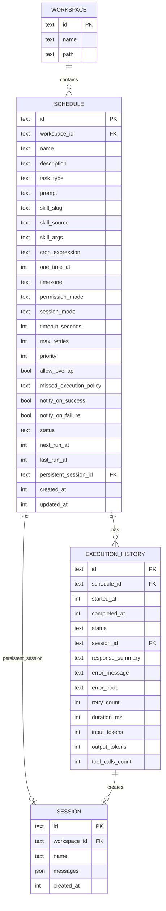

# feat: Cron Scheduler for Automated Agent Tasks

## Overview

A comprehensive scheduling system for Vesper that enables users to schedule recurring or one-off agent tasks. The scheduler supports agent chat sessions, Skill execution, and information retrieval tasks with native OS notifications and background execution via macOS launchd.

**Key Capabilities:**
- Schedule tasks from both UI and chat commands
- SQLite persistence for schedules and execution history
- Background execution when app is closed (via launchd)
- Native macOS notifications for task results
- Support for one-time and recurring (cron) schedules

---

## Problem Statement

Currently, Vesper users must manually initiate every agent interaction. There's no way to:
- Run automated morning briefings or daily summaries
- Schedule recurring code reviews or deployments
- Set reminders that trigger agent actions
- Execute Skills on a schedule (e.g., nightly backups, weekly reports)

Users need a way to "set and forget" agent tasks that run automatically at specified times, even when the app isn't open.

---

## Proposed Solution

### Architecture Overview

```
┌─────────────────────────────────────────────────────────────────┐
│                         Vesper App                               │
├─────────────────────────────────────────────────────────────────┤
│  Renderer Process (React)                                        │
│  ┌─────────────────┐  ┌─────────────────┐  ┌─────────────────┐  │
│  │ Schedule List   │  │ Schedule Editor │  │ Execution       │  │
│  │ Component       │  │ (Cron Builder)  │  │ History View    │  │
│  └────────┬────────┘  └────────┬────────┘  └────────┬────────┘  │
│           │                    │                    │            │
│           └────────────────────┼────────────────────┘            │
│                                │ IPC                             │
├────────────────────────────────┼────────────────────────────────┤
│  Main Process (Electron)       │                                 │
│  ┌─────────────────────────────▼─────────────────────────────┐  │
│  │              Scheduler Service                             │  │
│  │  ┌──────────────┐  ┌──────────────┐  ┌──────────────┐     │  │
│  │  │ Cron Engine  │  │ Task Queue   │  │ Executor     │     │  │
│  │  │ (Croner)     │  │ (Priority)   │  │ (Headless)   │     │  │
│  │  └──────────────┘  └──────────────┘  └──────────────┘     │  │
│  └───────────────────────────┬───────────────────────────────┘  │
│                              │                                   │
│  ┌───────────────────────────▼───────────────────────────────┐  │
│  │              SQLite Database                               │  │
│  │  schedules | execution_history | schema_version            │  │
│  └───────────────────────────────────────────────────────────┘  │
└─────────────────────────────────────────────────────────────────┘
                               │
                               │ launchd (background)
                               ▼
┌─────────────────────────────────────────────────────────────────┐
│  macOS launchd Service                                          │
│  com.craft-agent.scheduler.plist                                │
│  - Spawns Vesper in headless mode when task is due              │
│  - Runs even when main app is closed                            │
└─────────────────────────────────────────────────────────────────┘
```

### Core Components

1. **Scheduler Service** (`apps/electron/src/main/scheduler/`)
   - Manages cron jobs using Croner library
   - Maintains task queue with priority ordering
   - Executes tasks via HeadlessRunner

2. **SQLite Database** (`~/.craft-agent/scheduler.db`)
   - Persists schedule definitions
   - Stores execution history
   - Tracks schema versions for migrations

3. **launchd Integration** (`apps/electron/src/main/scheduler/launchd.ts`)
   - Generates and manages plist files
   - Enables background execution when app is closed
   - Handles startup recovery for missed tasks

4. **UI Components** (`apps/electron/src/renderer/components/scheduler/`)
   - Schedule list with status indicators
   - Cron expression builder (visual)
   - Execution history viewer

---

## Technical Approach

### Phase 1: Core Infrastructure

#### 1.1 SQLite Database Setup

**File:** `packages/shared/src/scheduler/database.ts`

```typescript
import Database from 'better-sqlite3';
import path from 'path';

export interface Schedule {
  id: string;
  workspace_id: string;
  name: string;
  description?: string;
  task_type: 'chat' | 'skill' | 'retrieval';
  prompt?: string;
  skill_slug?: string;
  skill_source?: 'workspace' | 'global' | 'claude-code';
  skill_args?: string;
  cron_expression?: string;
  one_time_at?: number;
  timezone: string;
  permission_mode: 'safe' | 'ask' | 'allow-all';
  session_mode: 'fresh' | 'persistent';
  timeout_seconds: number;
  max_retries: number;
  priority: 1 | 2 | 3 | 4;
  allow_overlap: boolean;
  missed_execution_policy: 'skip' | 'run_once' | 'run_all';
  notify_on_success: boolean;
  notify_on_failure: boolean;
  status: 'active' | 'paused' | 'invalid' | 'completed';
  next_run_at?: number;
  last_run_at?: number;
  persistent_session_id?: string;
  created_at: number;
  updated_at: number;
}

export interface ExecutionHistory {
  id: string;
  schedule_id: string;
  started_at: number;
  completed_at?: number;
  status: 'running' | 'success' | 'failed' | 'timeout' | 'cancelled' | 'skipped';
  session_id?: string;
  response_summary?: string;
  error_message?: string;
  error_code?: string;
  retry_count: number;
  duration_ms?: number;
  input_tokens?: number;
  output_tokens?: number;
  tool_calls_count?: number;
}
```

**Schema SQL:**

```sql
CREATE TABLE IF NOT EXISTS schedules (
  id TEXT PRIMARY KEY,
  workspace_id TEXT NOT NULL,
  name TEXT NOT NULL,
  description TEXT,
  task_type TEXT NOT NULL CHECK(task_type IN ('chat', 'skill', 'retrieval')),
  prompt TEXT,
  skill_slug TEXT,
  skill_source TEXT,
  skill_args TEXT,
  cron_expression TEXT,
  one_time_at INTEGER,
  timezone TEXT DEFAULT 'UTC',
  permission_mode TEXT DEFAULT 'safe',
  session_mode TEXT DEFAULT 'fresh',
  timeout_seconds INTEGER DEFAULT 600,
  max_retries INTEGER DEFAULT 3,
  priority INTEGER DEFAULT 2,
  allow_overlap INTEGER DEFAULT 0,
  missed_execution_policy TEXT DEFAULT 'run_once',
  notify_on_success INTEGER DEFAULT 1,
  notify_on_failure INTEGER DEFAULT 1,
  status TEXT DEFAULT 'active',
  next_run_at INTEGER,
  last_run_at INTEGER,
  persistent_session_id TEXT,
  created_at INTEGER NOT NULL,
  updated_at INTEGER NOT NULL
);

CREATE TABLE IF NOT EXISTS execution_history (
  id TEXT PRIMARY KEY,
  schedule_id TEXT NOT NULL,
  started_at INTEGER NOT NULL,
  completed_at INTEGER,
  status TEXT NOT NULL,
  session_id TEXT,
  response_summary TEXT,
  error_message TEXT,
  error_code TEXT,
  retry_count INTEGER DEFAULT 0,
  duration_ms INTEGER,
  input_tokens INTEGER,
  output_tokens INTEGER,
  tool_calls_count INTEGER,
  FOREIGN KEY (schedule_id) REFERENCES schedules(id) ON DELETE CASCADE
);

CREATE TABLE IF NOT EXISTS schema_version (
  version INTEGER PRIMARY KEY,
  applied_at INTEGER NOT NULL
);

CREATE INDEX IF NOT EXISTS idx_schedules_workspace ON schedules(workspace_id);
CREATE INDEX IF NOT EXISTS idx_schedules_next_run ON schedules(next_run_at) WHERE status = 'active';
CREATE INDEX IF NOT EXISTS idx_schedules_status ON schedules(status);
CREATE INDEX IF NOT EXISTS idx_execution_schedule ON execution_history(schedule_id);
CREATE INDEX IF NOT EXISTS idx_execution_started ON execution_history(started_at DESC);
```

#### 1.2 Schedule CRUD Operations

**File:** `packages/shared/src/scheduler/storage.ts`

```typescript
export async function createSchedule(schedule: Omit<Schedule, 'id' | 'created_at' | 'updated_at'>): Promise<Schedule>;
export async function getSchedule(id: string): Promise<Schedule | null>;
export async function listSchedules(workspaceId: string): Promise<Schedule[]>;
export async function updateSchedule(id: string, updates: Partial<Schedule>): Promise<Schedule>;
export async function deleteSchedule(id: string): Promise<void>;
export async function pauseSchedule(id: string): Promise<void>;
export async function resumeSchedule(id: string): Promise<void>;

export async function recordExecution(execution: Omit<ExecutionHistory, 'id'>): Promise<ExecutionHistory>;
export async function getExecutionHistory(scheduleId: string, limit?: number): Promise<ExecutionHistory[]>;
export async function updateExecution(id: string, updates: Partial<ExecutionHistory>): Promise<void>;
```

#### 1.3 Cron Expression Handling

**Dependencies:**
- `croner` - Cron job scheduling (best performance, zero deps)
- `cronstrue` - Human-readable cron descriptions
- `cron-parser` - Parse and validate expressions

**File:** `packages/shared/src/scheduler/cron.ts`

```typescript
import { Cron } from 'croner';
import cronstrue from 'cronstrue';
import { CronExpressionParser } from 'cron-parser';

export function validateCronExpression(expression: string): { valid: boolean; error?: string } {
  try {
    CronExpressionParser.parse(expression);
    return { valid: true };
  } catch (e) {
    return { valid: false, error: e.message };
  }
}

export function getHumanReadableCron(expression: string): string {
  return cronstrue.toString(expression);
}

export function getNextRunTimes(expression: string, count: number, timezone?: string): Date[] {
  const cron = new Cron(expression, { timezone });
  return cron.nextRuns(count);
}

export function calculateNextRunAt(expression: string, timezone: string): number {
  const cron = new Cron(expression, { timezone });
  const next = cron.nextRun();
  return next ? Math.floor(next.getTime() / 1000) : 0;
}
```

---

### Phase 2: Execution Engine

#### 2.1 Scheduler Service

**File:** `apps/electron/src/main/scheduler/scheduler-service.ts`

```typescript
import { Cron } from 'croner';
import { Schedule, ExecutionHistory } from '@craft-agent/shared/scheduler';

interface QueuedTask {
  schedule: Schedule;
  priority: number;
  queuedAt: number;
}

export class SchedulerService {
  private jobs: Map<string, Cron> = new Map();
  private taskQueue: QueuedTask[] = [];
  private isProcessing = false;
  private db: Database;

  constructor(dbPath: string) {
    this.db = new Database(dbPath);
    this.initializeSchema();
  }

  async start(): Promise<void> {
    // Load active schedules and create cron jobs
    const schedules = await this.getActiveSchedules();
    for (const schedule of schedules) {
      this.scheduleTask(schedule);
    }

    // Check for missed executions on startup
    await this.handleMissedExecutions();

    // Start queue processor
    this.processQueue();
  }

  async stop(): Promise<void> {
    for (const job of this.jobs.values()) {
      job.stop();
    }
    this.jobs.clear();
  }

  scheduleTask(schedule: Schedule): void {
    if (schedule.cron_expression) {
      const job = new Cron(
        schedule.cron_expression,
        { timezone: schedule.timezone },
        () => this.enqueueTask(schedule)
      );
      this.jobs.set(schedule.id, job);
    } else if (schedule.one_time_at) {
      const runAt = new Date(schedule.one_time_at * 1000);
      const job = new Cron(runAt, () => {
        this.enqueueTask(schedule);
        this.jobs.delete(schedule.id);
      });
      this.jobs.set(schedule.id, job);
    }
  }

  private enqueueTask(schedule: Schedule): void {
    this.taskQueue.push({
      schedule,
      priority: schedule.priority,
      queuedAt: Date.now()
    });
    this.taskQueue.sort((a, b) => b.priority - a.priority || a.queuedAt - b.queuedAt);
    this.processQueue();
  }

  private async processQueue(): Promise<void> {
    if (this.isProcessing || this.taskQueue.length === 0) return;

    this.isProcessing = true;
    while (this.taskQueue.length > 0) {
      const task = this.taskQueue.shift()!;
      await this.executeTask(task.schedule);
    }
    this.isProcessing = false;
  }

  private async executeTask(schedule: Schedule): Promise<void> {
    const executionId = generateId();
    const startedAt = Math.floor(Date.now() / 1000);

    // Record execution start
    await this.recordExecution({
      id: executionId,
      schedule_id: schedule.id,
      started_at: startedAt,
      status: 'running',
      retry_count: 0
    });

    try {
      const result = await this.runHeadlessTask(schedule);

      await this.updateExecution(executionId, {
        completed_at: Math.floor(Date.now() / 1000),
        status: 'success',
        session_id: result.sessionId,
        response_summary: result.summary?.substring(0, 500),
        duration_ms: Date.now() - startedAt * 1000,
        input_tokens: result.inputTokens,
        output_tokens: result.outputTokens,
        tool_calls_count: result.toolCalls
      });

      if (schedule.notify_on_success) {
        this.showNotification(schedule, 'success', result.summary);
      }
    } catch (error) {
      await this.updateExecution(executionId, {
        completed_at: Math.floor(Date.now() / 1000),
        status: 'failed',
        error_message: error.message,
        duration_ms: Date.now() - startedAt * 1000
      });

      if (schedule.notify_on_failure) {
        this.showNotification(schedule, 'failed', error.message);
      }
    }

    // Update next_run_at for recurring schedules
    if (schedule.cron_expression) {
      const nextRun = calculateNextRunAt(schedule.cron_expression, schedule.timezone);
      await this.updateSchedule(schedule.id, {
        next_run_at: nextRun,
        last_run_at: startedAt
      });
    } else {
      // One-time task completed
      await this.updateSchedule(schedule.id, {
        status: 'completed',
        last_run_at: startedAt
      });
    }
  }

  private async runHeadlessTask(schedule: Schedule): Promise<HeadlessResult> {
    // Use existing HeadlessRunner with timeout
    const controller = new AbortController();
    const timeout = setTimeout(() => controller.abort(), schedule.timeout_seconds * 1000);

    try {
      const runner = new HeadlessRunner({
        workspaceId: schedule.workspace_id,
        permissionMode: schedule.permission_mode,
        signal: controller.signal
      });

      if (schedule.task_type === 'chat') {
        return await runner.run(schedule.prompt!);
      } else if (schedule.task_type === 'skill') {
        const skill = await loadSkill(schedule.workspace_id, schedule.skill_slug!);
        return await runner.runSkill(skill, schedule.skill_args);
      }
    } finally {
      clearTimeout(timeout);
    }
  }
}
```

#### 2.2 IPC Handlers

**File:** `apps/electron/src/main/scheduler/ipc-handlers.ts`

**New IPC Channels:**

```typescript
export const SCHEDULER_CHANNELS = {
  // Schedule CRUD
  SCHEDULE_CREATE: 'scheduler:create',
  SCHEDULE_GET: 'scheduler:get',
  SCHEDULE_LIST: 'scheduler:list',
  SCHEDULE_UPDATE: 'scheduler:update',
  SCHEDULE_DELETE: 'scheduler:delete',
  SCHEDULE_PAUSE: 'scheduler:pause',
  SCHEDULE_RESUME: 'scheduler:resume',

  // Execution
  SCHEDULE_RUN_NOW: 'scheduler:run-now',
  SCHEDULE_CANCEL: 'scheduler:cancel',

  // History
  EXECUTION_HISTORY_GET: 'scheduler:history:get',
  EXECUTION_HISTORY_LIST: 'scheduler:history:list',

  // Events (main -> renderer)
  SCHEDULE_EVENT: 'scheduler:event',
} as const;
```

**Handler Registration:**

```typescript
export function registerSchedulerHandlers(scheduler: SchedulerService): void {
  ipcMain.handle(SCHEDULER_CHANNELS.SCHEDULE_CREATE, async (_, schedule) => {
    return scheduler.createSchedule(schedule);
  });

  ipcMain.handle(SCHEDULER_CHANNELS.SCHEDULE_LIST, async (_, workspaceId) => {
    return scheduler.listSchedules(workspaceId);
  });

  ipcMain.handle(SCHEDULER_CHANNELS.SCHEDULE_UPDATE, async (_, id, updates) => {
    return scheduler.updateSchedule(id, updates);
  });

  ipcMain.handle(SCHEDULER_CHANNELS.SCHEDULE_DELETE, async (_, id) => {
    return scheduler.deleteSchedule(id);
  });

  ipcMain.handle(SCHEDULER_CHANNELS.SCHEDULE_PAUSE, async (_, id) => {
    return scheduler.pauseSchedule(id);
  });

  ipcMain.handle(SCHEDULER_CHANNELS.SCHEDULE_RESUME, async (_, id) => {
    return scheduler.resumeSchedule(id);
  });

  ipcMain.handle(SCHEDULER_CHANNELS.SCHEDULE_RUN_NOW, async (_, id) => {
    return scheduler.runNow(id);
  });

  ipcMain.handle(SCHEDULER_CHANNELS.EXECUTION_HISTORY_LIST, async (_, scheduleId, limit) => {
    return scheduler.getExecutionHistory(scheduleId, limit);
  });
}
```

---

### Phase 3: Background Service (launchd)

#### 3.1 launchd Plist Management

**File:** `apps/electron/src/main/scheduler/launchd.ts`

```typescript
import { writeFile, unlink, mkdir } from 'fs/promises';
import { execSync } from 'child_process';
import path from 'path';

const PLIST_DIR = path.join(process.env.HOME!, 'Library/LaunchAgents');
const PLIST_PREFIX = 'com.craft-agent.scheduler';

export async function installLaunchdService(schedule: Schedule): Promise<void> {
  const plistName = `${PLIST_PREFIX}.${schedule.id}.plist`;
  const plistPath = path.join(PLIST_DIR, plistName);

  const plistContent = generatePlist(schedule);

  await mkdir(PLIST_DIR, { recursive: true });
  await writeFile(plistPath, plistContent);

  // Load the service
  execSync(`launchctl load "${plistPath}"`);
}

export async function uninstallLaunchdService(scheduleId: string): Promise<void> {
  const plistName = `${PLIST_PREFIX}.${scheduleId}.plist`;
  const plistPath = path.join(PLIST_DIR, plistName);

  try {
    execSync(`launchctl unload "${plistPath}"`);
    await unlink(plistPath);
  } catch (e) {
    // Service may not be loaded
  }
}

function generatePlist(schedule: Schedule): string {
  const appPath = process.execPath;
  const cronToCalendarInterval = parseCronToCalendarInterval(schedule.cron_expression!);

  return `<?xml version="1.0" encoding="UTF-8"?>
<!DOCTYPE plist PUBLIC "-//Apple//DTD PLIST 1.0//EN" "http://www.apple.com/DTDs/PropertyList-1.0.dtd">
<plist version="1.0">
<dict>
    <key>Label</key>
    <string>${PLIST_PREFIX}.${schedule.id}</string>

    <key>ProgramArguments</key>
    <array>
        <string>${appPath}</string>
        <string>--headless</string>
        <string>--schedule-id=${schedule.id}</string>
    </array>

    <key>RunAtLoad</key>
    <false/>

    <key>StartCalendarInterval</key>
    ${cronToCalendarInterval}

    <key>StandardOutPath</key>
    <string>${process.env.HOME}/.craft-agent/logs/scheduler-${schedule.id}.log</string>

    <key>StandardErrorPath</key>
    <string>${process.env.HOME}/.craft-agent/logs/scheduler-${schedule.id}.error.log</string>
</dict>
</plist>`;
}

function parseCronToCalendarInterval(cron: string): string {
  // Convert cron expression to launchd StartCalendarInterval format
  const parts = cron.split(' ');
  const [minute, hour, dayOfMonth, month, dayOfWeek] = parts;

  let interval = '<dict>\n';

  if (minute !== '*') {
    interval += `        <key>Minute</key>\n        <integer>${minute}</integer>\n`;
  }
  if (hour !== '*') {
    interval += `        <key>Hour</key>\n        <integer>${hour}</integer>\n`;
  }
  if (dayOfMonth !== '*') {
    interval += `        <key>Day</key>\n        <integer>${dayOfMonth}</integer>\n`;
  }
  if (month !== '*') {
    interval += `        <key>Month</key>\n        <integer>${month}</integer>\n`;
  }
  if (dayOfWeek !== '*') {
    interval += `        <key>Weekday</key>\n        <integer>${dayOfWeek}</integer>\n`;
  }

  interval += '    </dict>';
  return interval;
}
```

#### 3.2 Headless Mode Entry Point

**File:** `apps/electron/src/main/headless-entry.ts`

```typescript
import { app } from 'electron';
import { SchedulerService } from './scheduler/scheduler-service';

// Check if running in headless mode
const args = process.argv;
const headlessIndex = args.indexOf('--headless');
const scheduleIdArg = args.find(arg => arg.startsWith('--schedule-id='));

if (headlessIndex !== -1 && scheduleIdArg) {
  const scheduleId = scheduleIdArg.split('=')[1];

  app.whenReady().then(async () => {
    // Run without creating windows
    app.dock?.hide();

    const scheduler = new SchedulerService(getDbPath());
    await scheduler.runScheduleById(scheduleId);

    app.quit();
  });
} else {
  // Normal app startup
  require('./index');
}
```

---

### Phase 4: UI Components

#### 4.1 Schedule List Component

**File:** `apps/electron/src/renderer/components/scheduler/ScheduleList.tsx`

```tsx
import { useAtom } from 'jotai';
import { schedulesAtom } from '../../atoms/scheduler';
import { ScheduleCard } from './ScheduleCard';

export function ScheduleList() {
  const [schedules] = useAtom(schedulesAtom);

  return (
    <div className="space-y-3">
      {schedules.length === 0 ? (
        <EmptyState />
      ) : (
        schedules.map(schedule => (
          <ScheduleCard key={schedule.id} schedule={schedule} />
        ))
      )}
    </div>
  );
}

function ScheduleCard({ schedule }: { schedule: Schedule }) {
  return (
    <div className="p-4 rounded-lg border bg-card">
      <div className="flex items-center justify-between">
        <div>
          <h3 className="font-medium">{schedule.name}</h3>
          <p className="text-sm text-muted-foreground">
            {getHumanReadableCron(schedule.cron_expression)}
          </p>
        </div>
        <div className="flex items-center gap-2">
          <StatusBadge status={schedule.status} />
          <ScheduleActions schedule={schedule} />
        </div>
      </div>
      <div className="mt-2 text-xs text-muted-foreground">
        Next run: {formatRelativeTime(schedule.next_run_at)}
      </div>
    </div>
  );
}
```

#### 4.2 Cron Builder Component

**File:** `apps/electron/src/renderer/components/scheduler/CronBuilder.tsx`

Using `@vpfaiz/cron-builder-ui` for Tailwind/Radix compatibility:

```tsx
import { CronBuilder as CronBuilderUI, getCronText } from '@vpfaiz/cron-builder-ui';
import '@vpfaiz/cron-builder-ui/styles/globals.css';

interface CronBuilderProps {
  value: string;
  onChange: (value: string) => void;
}

export function CronBuilder({ value, onChange }: CronBuilderProps) {
  const cronText = getCronText(value);

  return (
    <div className="space-y-4">
      <CronBuilderUI
        defaultValue={value}
        onChange={onChange}
      />

      <div className="p-3 rounded-md bg-muted">
        <p className="text-sm font-medium">Schedule Preview</p>
        <p className="text-sm text-muted-foreground">
          {cronText.status ? cronText.value : 'Invalid expression'}
        </p>

        <div className="mt-2">
          <p className="text-xs font-medium">Next 5 runs:</p>
          <ul className="text-xs text-muted-foreground">
            {getNextRunTimes(value, 5).map((date, i) => (
              <li key={i}>{formatDateTime(date)}</li>
            ))}
          </ul>
        </div>
      </div>
    </div>
  );
}
```

#### 4.3 Schedule Editor Modal

**File:** `apps/electron/src/renderer/components/scheduler/ScheduleEditor.tsx`

```tsx
export function ScheduleEditor({ schedule, onSave, onClose }: ScheduleEditorProps) {
  const [form, setForm] = useState<ScheduleForm>(schedule || defaultForm);

  return (
    <Dialog open onOpenChange={onClose}>
      <DialogContent className="max-w-2xl">
        <DialogHeader>
          <DialogTitle>
            {schedule ? 'Edit Schedule' : 'New Schedule'}
          </DialogTitle>
        </DialogHeader>

        <div className="space-y-6">
          {/* Name */}
          <div>
            <Label>Name</Label>
            <Input
              value={form.name}
              onChange={e => setForm(f => ({ ...f, name: e.target.value }))}
              placeholder="Morning Standup Summary"
            />
          </div>

          {/* Task Type */}
          <div>
            <Label>Task Type</Label>
            <Select
              value={form.task_type}
              onValueChange={v => setForm(f => ({ ...f, task_type: v }))}
            >
              <SelectItem value="chat">Agent Chat</SelectItem>
              <SelectItem value="skill">Skill Execution</SelectItem>
              <SelectItem value="retrieval">Information Retrieval</SelectItem>
            </Select>
          </div>

          {/* Prompt (for chat type) */}
          {form.task_type === 'chat' && (
            <div>
              <Label>Prompt</Label>
              <Textarea
                value={form.prompt}
                onChange={e => setForm(f => ({ ...f, prompt: e.target.value }))}
                placeholder="Summarize my calendar for today..."
                rows={4}
              />
            </div>
          )}

          {/* Skill Selection (for skill type) */}
          {form.task_type === 'skill' && (
            <SkillSelector
              value={form.skill_slug}
              onChange={slug => setForm(f => ({ ...f, skill_slug: slug }))}
            />
          )}

          {/* Schedule Type */}
          <div>
            <Label>Schedule Type</Label>
            <RadioGroup
              value={form.schedule_type}
              onValueChange={v => setForm(f => ({ ...f, schedule_type: v }))}
            >
              <RadioGroupItem value="recurring" label="Recurring" />
              <RadioGroupItem value="one_time" label="One-time" />
            </RadioGroup>
          </div>

          {/* Cron Builder (for recurring) */}
          {form.schedule_type === 'recurring' && (
            <CronBuilder
              value={form.cron_expression}
              onChange={v => setForm(f => ({ ...f, cron_expression: v }))}
            />
          )}

          {/* Date/Time Picker (for one-time) */}
          {form.schedule_type === 'one_time' && (
            <DateTimePicker
              value={form.one_time_at}
              onChange={v => setForm(f => ({ ...f, one_time_at: v }))}
            />
          )}

          {/* Advanced Options (collapsible) */}
          <Collapsible>
            <CollapsibleTrigger>Advanced Options</CollapsibleTrigger>
            <CollapsibleContent>
              <div className="space-y-4 pt-4">
                {/* Permission Mode */}
                <div>
                  <Label>Permission Mode</Label>
                  <Select
                    value={form.permission_mode}
                    onValueChange={v => setForm(f => ({ ...f, permission_mode: v }))}
                  >
                    <SelectItem value="safe">Safe (Read-only)</SelectItem>
                    <SelectItem value="ask">Ask (Default)</SelectItem>
                    <SelectItem value="allow-all">Allow All</SelectItem>
                  </Select>
                  {form.permission_mode === 'allow-all' && (
                    <p className="text-xs text-destructive mt-1">
                      ⚠️ This allows the agent to execute any command without confirmation
                    </p>
                  )}
                </div>

                {/* Timeout */}
                <div>
                  <Label>Timeout (seconds)</Label>
                  <Input
                    type="number"
                    value={form.timeout_seconds}
                    onChange={e => setForm(f => ({ ...f, timeout_seconds: parseInt(e.target.value) }))}
                  />
                </div>

                {/* Notification Settings */}
                <div className="space-y-2">
                  <Label>Notifications</Label>
                  <Checkbox
                    checked={form.notify_on_success}
                    onCheckedChange={v => setForm(f => ({ ...f, notify_on_success: v }))}
                    label="Notify on success"
                  />
                  <Checkbox
                    checked={form.notify_on_failure}
                    onCheckedChange={v => setForm(f => ({ ...f, notify_on_failure: v }))}
                    label="Notify on failure"
                  />
                </div>
              </div>
            </CollapsibleContent>
          </Collapsible>
        </div>

        <DialogFooter>
          <Button variant="outline" onClick={onClose}>Cancel</Button>
          <Button onClick={() => onSave(form)}>
            {schedule ? 'Save Changes' : 'Create Schedule'}
          </Button>
        </DialogFooter>
      </DialogContent>
    </Dialog>
  );
}
```

#### 4.4 Execution History Component

**File:** `apps/electron/src/renderer/components/scheduler/ExecutionHistory.tsx`

```tsx
export function ExecutionHistory({ scheduleId }: { scheduleId: string }) {
  const [history, setHistory] = useState<ExecutionHistory[]>([]);

  useEffect(() => {
    window.electronAPI.getExecutionHistory(scheduleId, 50).then(setHistory);
  }, [scheduleId]);

  return (
    <div className="space-y-2">
      {history.map(execution => (
        <div
          key={execution.id}
          className="p-3 rounded-md border bg-card flex items-center justify-between"
        >
          <div className="flex items-center gap-3">
            <StatusIcon status={execution.status} />
            <div>
              <p className="text-sm font-medium">
                {formatDateTime(execution.started_at * 1000)}
              </p>
              <p className="text-xs text-muted-foreground">
                Duration: {formatDuration(execution.duration_ms)}
              </p>
            </div>
          </div>

          <div className="flex items-center gap-2">
            {execution.session_id && (
              <Button
                variant="ghost"
                size="sm"
                onClick={() => navigateToSession(execution.session_id)}
              >
                View Session
              </Button>
            )}
            {execution.error_message && (
              <Tooltip content={execution.error_message}>
                <AlertCircle className="w-4 h-4 text-destructive" />
              </Tooltip>
            )}
          </div>
        </div>
      ))}
    </div>
  );
}
```

---

### Phase 5: Chat Commands

#### 5.1 Session-Scoped Tools

**File:** `packages/shared/src/agent/session-scoped-tools.ts`

Add new scheduler tools:

```typescript
export const schedulerTools: Tool[] = [
  {
    name: 'schedule_create',
    description: 'Create a new scheduled task',
    input_schema: {
      type: 'object',
      properties: {
        name: { type: 'string', description: 'Name for the schedule' },
        prompt: { type: 'string', description: 'The prompt to run on schedule' },
        cron_expression: { type: 'string', description: 'Cron expression (e.g., "0 9 * * *" for daily at 9am)' },
        timezone: { type: 'string', description: 'IANA timezone (default: user local)' }
      },
      required: ['name', 'prompt', 'cron_expression']
    }
  },
  {
    name: 'schedule_list',
    description: 'List all scheduled tasks in the current workspace',
    input_schema: {
      type: 'object',
      properties: {}
    }
  },
  {
    name: 'schedule_pause',
    description: 'Pause a scheduled task',
    input_schema: {
      type: 'object',
      properties: {
        schedule_id: { type: 'string', description: 'ID of the schedule to pause' }
      },
      required: ['schedule_id']
    }
  },
  {
    name: 'schedule_delete',
    description: 'Delete a scheduled task',
    input_schema: {
      type: 'object',
      properties: {
        schedule_id: { type: 'string', description: 'ID of the schedule to delete' }
      },
      required: ['schedule_id']
    }
  }
];
```

---

## Acceptance Criteria

### Functional Requirements

- [ ] User can create recurring schedules with cron expressions from UI
- [ ] User can create one-time scheduled tasks with date/time picker
- [ ] User can schedule agent chat sessions with custom prompts
- [ ] User can schedule Skill executions
- [ ] User can pause, resume, and delete schedules
- [ ] User can view execution history for each schedule
- [ ] Schedules persist across app restarts
- [ ] Tasks execute at scheduled times when app is open
- [ ] Tasks execute via launchd when app is closed (macOS)
- [ ] Native notifications shown on task completion/failure
- [ ] User can create schedules via chat commands (/schedule)
- [ ] Clicking notification navigates to the task's session

### Non-Functional Requirements

- [ ] SQLite database properly initialized on first run
- [ ] Schema migrations run automatically on app update
- [ ] Cron expressions validated before saving
- [ ] Human-readable schedule descriptions shown in UI
- [ ] Task timeout enforced (default 10 minutes)
- [ ] Missed executions handled according to policy
- [ ] Background service properly installed/uninstalled with schedules

### Quality Gates

- [ ] Unit tests for cron parsing and next-run calculation
- [ ] Integration tests for schedule CRUD operations
- [ ] E2E tests for creating schedule from UI
- [ ] Test coverage for edge cases (DST, timezone changes)
- [ ] launchd plist generation tested on macOS

---

## Dependencies

### New npm Packages

| Package | Version | Purpose |
|---------|---------|---------|
| `croner` | ^9.0.0 | Cron job scheduling |
| `cronstrue` | ^2.50.0 | Human-readable cron |
| `cron-parser` | ^5.0.0 | Cron validation |
| `better-sqlite3` | ^11.0.0 | SQLite database |
| `@vpfaiz/cron-builder-ui` | ^1.0.0 | Visual cron builder |

### Existing Dependencies Used

- `@anthropic-ai/claude-agent-sdk` - Agent execution
- `electron` - Native notifications, IPC
- `jotai` - State management
- `@radix-ui/*` - UI components

---

## File Structure

```
apps/electron/src/
├── main/
│   ├── scheduler/
│   │   ├── index.ts              # Scheduler service export
│   │   ├── scheduler-service.ts  # Core scheduling logic
│   │   ├── database.ts           # SQLite operations
│   │   ├── launchd.ts            # macOS launchd integration
│   │   ├── ipc-handlers.ts       # IPC channel handlers
│   │   └── types.ts              # TypeScript interfaces
│   ├── headless-entry.ts         # Headless mode entry point
│   └── index.ts                  # Updated to init scheduler
├── preload/
│   └── index.ts                  # Add scheduler API exposure
└── renderer/
    ├── atoms/
    │   └── scheduler.ts          # Jotai atoms for scheduler state
    ├── components/
    │   └── scheduler/
    │       ├── ScheduleList.tsx
    │       ├── ScheduleCard.tsx
    │       ├── ScheduleEditor.tsx
    │       ├── CronBuilder.tsx
    │       ├── ExecutionHistory.tsx
    │       └── index.ts
    └── pages/
        └── SchedulesPage.tsx     # Main schedules page

packages/shared/src/
├── scheduler/
│   ├── index.ts                  # Public exports
│   ├── types.ts                  # Shared types
│   ├── cron.ts                   # Cron utilities
│   └── storage.ts                # Database operations
└── agent/
    └── session-scoped-tools.ts   # Add scheduler tools
```

---

## ERD Diagram



---

## Risk Analysis

| Risk | Impact | Likelihood | Mitigation |
|------|--------|------------|------------|
| launchd permission issues | HIGH | MEDIUM | Test on multiple macOS versions, provide fallback to in-app scheduling |
| SQLite corruption | HIGH | LOW | Use WAL mode, implement backup/recovery |
| Missed execution flood on startup | MEDIUM | MEDIUM | Implement `missed_execution_policy` with sensible defaults |
| Long-running tasks block queue | MEDIUM | MEDIUM | Implement timeout, consider parallel execution option |
| User creates too many schedules | LOW | LOW | UI warning at 50+ schedules, performance testing |

---

## Future Considerations

1. **Windows/Linux Support**: Implement equivalent background services (Task Scheduler on Windows, systemd on Linux)
2. **Remote Execution**: Run scheduled tasks on Claude.ai web when local machine is offline
3. **Schedule Templates**: Pre-built schedules for common tasks (daily standup, weekly review)
4. **Conditional Execution**: Run only if certain conditions are met (e.g., new emails exist)
5. **Webhook Integration**: Trigger schedules via external webhooks
6. **Team Sharing**: Share schedules across team workspaces

---

## References

### Internal References
- Session management: `apps/electron/src/main/sessions.ts`
- HeadlessRunner: `packages/shared/src/headless/runner.ts`
- Skills loading: `packages/shared/src/skills/storage.ts`
- Notifications: `apps/electron/src/main/notifications.ts`
- IPC channels: `apps/electron/src/shared/types.ts:493-639`

### External References
- [Croner Documentation](https://croner.56k.guru)
- [cronstrue GitHub](https://github.com/bradymholt/cRonstrue)
- [better-sqlite3 GitHub](https://github.com/WiseLibs/better-sqlite3)
- [Apple launchd Documentation](https://developer.apple.com/library/archive/documentation/MacOSX/Conceptual/BPSystemStartup/Chapters/CreatingLaunchdJobs.html)
- [Electron Notification API](https://www.electronjs.org/docs/latest/api/notification)
- [cron-builder-ui](https://github.com/vpfaiz/cron-builder-ui)

---

🤖 Generated with [Claude Code](https://claude.ai/claude-code)
